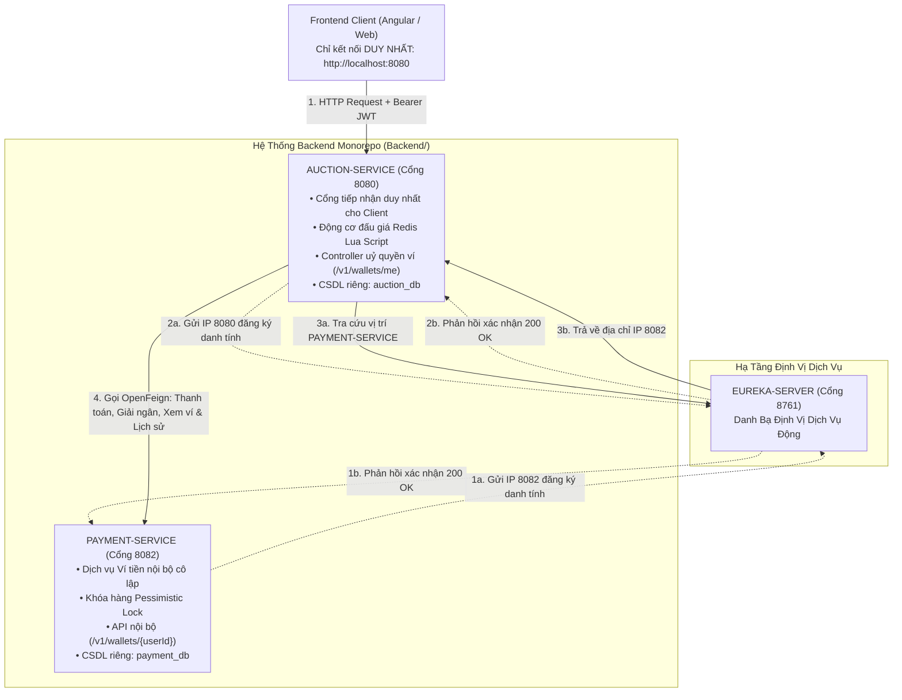
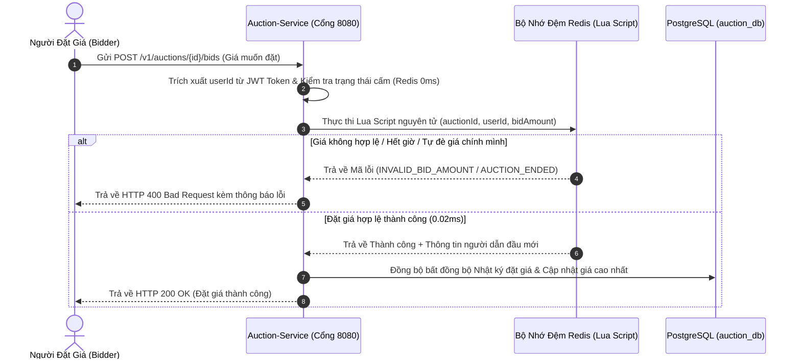
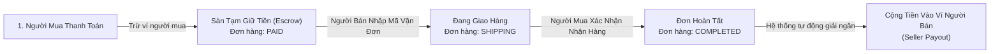
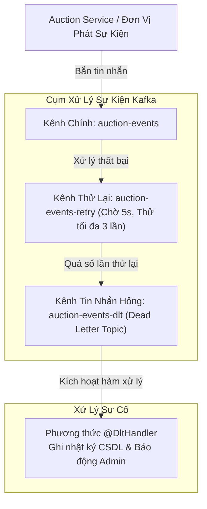

# HỆ THỐNG ĐẤU GIÁ — TÀI LIỆU MASTER BACKEND MONOREPO

---


## 1. DỰ ÁN & BÀI TOÁN NGHIỆP VỤ TỔNG QUAN

**Hệ Thống Đấu Giá (Backend Microservices)** là nền tảng **Đấu Giá Trực Tuyến Đa Ngành Hàng** được xây dựng trên kiến trúc Microservices Monorepo chuẩn doanh nghiệp.

Hệ thống được thiết kế để giải quyết triệt để các bài toán cốt lõi trong đấu giá thương mại điện tử thực tế:

- **Động cơ so kè giá nguyên tử (Redis Lua Script )**: Triệt tiêu 100% tình trạng **Xung đột ghi đồng thời (Race Condition)** khi hàng trăm người dùng cùng bấm nút đặt giá ở millisecond cuối cùng. Toàn bộ thao tác *Đọc giá ➔ Kiểm tra bước giá ➔ Ghi nhận người dẫn đầu* được thực thi nguyên tử trên RAM Redis trong khoảng ~0.02ms.
-  **Đấu giá tự động (Proxy Bidding)**: Cho phép người mua cài đặt mức giá trần tối đa (`maxBid`). Hệ thống tự động nâng bước giá tối thiểu để duy trì vị trí dẫn đầu cho người mua mà tuyệt đối không vượt quá giá trần cài đặt.
- **Chốt thầu thời gian cứng (Hard-Close)**: Áp dụng cơ chế đếm ngược thời gian cứng minh bạch. Hết giờ là hết giờ, không gia hạn ảo, đảm bảo tính công bằng tuyệt đối cho mọi phiên đấu giá.
-  **Mô hình Tạm Giữ Tiền & Giải Ngân (Escrow Settlement)**: Quản lý tiền an toàn qua 4 trạng thái:
  1. Người mua thanh toán đơn hàng ➔ Tiền được tạm giữ ở sàn (`PAID`).
  2. Người bán xuất hàng kèm mã vận đơn ➔ Trạng thái chuyển `SHIPPING`.
  3. Người mua bấm xác nhận đã nhận hàng ➔ Đơn hàng hoàn tất `COMPLETED`.
  4. Hệ thống tự động kích hoạt giải ngân cộng tiền vào ví người bán.
-  **Chế tài chống bùng hàng (Hạn 48h & Quy tắc phạt 3 gậy)**: Người trúng thầu có 48 giờ để thanh toán đơn hàng. Nếu quá 48h không thanh toán, Robot `AuctionScheduler` sẽ tự động hủy đơn, tích lũy **+1 gậy vi phạm (`unpaid_strike_count`)**. Khi tài khoản tích đủ 3 gậy vi phạm, hệ thống sẽ tự động thi hành án **cấm tham gia đấu giá trong 90 ngày (`banned_until`)**.
-  **Kiến trúc Cổng Tiếp Nhận Duy Nhất (Single Entry Point)**: Phân vùng mạng an toàn. Frontend chỉ kết nối tới Cổng **8080** (`auction-service`). Mọi thao tác truy vấn ví tiền đều được `auction-service` uỷ quyền gọi sang `payment-service` (Cổng **8082**) qua mạng nội bộ được bảo mật bằng Header bí mật.

---

## 2. KIẾN TRÚC HỆ THỐNG MONOREPO & PHÂN BỔ CỔNG MẠNG

Mã nguồn Backend được tổ chức dưới dạng **Monorepo (Backend/)** với 3 dự án dịch vụ độc lập:

```text
Backend/
├── documents/         # Thư viện tài liệu thiết kế hệ thống dùng chung cho toàn bộ dự án
├── eureka-server/     # Cổng 8761: Trạm đăng ký & định vị dịch vụ trung tâm (Service Discovery)
├── auction-service/   # Cổng 8080: Dịch vụ đấu giá chính, quản lý đơn hàng & Cổng tiếp nhận duy nhất
└── payment-service/   # Cổng 8082: Dịch vụ ví tiền ảo & sổ cái tài chính (Ẩn nội bộ cô lập)
```

### Bảng Phân Bổ Cổng Mạng & Nhiệm Vụ Kỹ Thuật

| Dịch Vụ | Cổng Mạng | Cơ Sở Dữ Liệu | Vai Trò & Nhiệm Vụ Kỹ Thuật | Bảo Mật & Phương Thức Giao Tiếp |
| :--- | :---: | :---: | :--- | :--- |
| **`eureka-server`** | `8761` | *Không dùng* | **Trạm đăng ký & Định vị Dịch vụ**: Nhận đăng ký danh tính động, duy trì trạng thái sống/chết qua nhịp tim 30s/lần. | Giao diện Dashboard: `http://localhost:8761` |
| **`auction-service`** | `8080` | `auction_db` (PostgreSQL) | **Đầu Đấu Giá Chính & Cổng Tiếp Nhận Duy Nhất**: Tiếp nhận 100% kết nối từ Frontend. Chứa nghiệp vụ Đấu giá, Sản phẩm, Đơn hàng, Scheduler ngầm 10s, và Controller ủy quyền xem ví `/v1/wallets/me`. | **Xác thực JWT Bearer Token** (Cổng 8080). Gửi OpenFeign sang `payment-service` kèm Header `X-Internal-Service-Key`. |
| **`payment-service`** | `8082` | `payment_db` (PostgreSQL) | **Dịch Vụ Ví Tiền & Sổ Cái Tài Chính**: Quản lý số dư ví tiền, tạm giữ tiền Escrow, giải ngân cho Người bán, áp dụng Khóa hàng `SELECT FOR UPDATE` và Mã khóa giao dịch nguyên tử `idempotency_key`. | **Ẩn hoàn toàn khỏi Internet (Mạng Nội Bộ)**. Bảo vệ 100% bằng Header bí mật `X-Internal-Service-Key` (So sánh thời gian cố định). |

---

## 3. SƠ ĐỒ LUỒNG KIẾN TRÚC & GIAO TIẾP (SƠ ĐỒ MERMAID)

### 🔹 1. Sơ đồ Luồng Giao Tiếp Qua Cổng Tiếp Nhận Duy Nhất



---

###  2. Sơ đồ Đấu Giá Trực Tuyến Nguyên Tử 0.02ms (Redis Lua Script Engine)



---

###  3. Sơ đồ Mô Hình Tạm Giữ Tiền & Giải Ngân Escrow



---

### 4. Sơ đồ Xử Lý Sự Cố Kafka Retry 3 Tầng (Tự Động Thử Lại & Xử Lý Tin Nhắn Hỏng)



---

## 4. TỔNG HỢP CÔNG NGHỆ & CẤU HÌNH HỆ THỐNG

Hệ thống được phát triển dựa trên các công nghệ tiên tiến nhất hiện nay:

- **Ngôn ngữ & Nền tảng cốt lõi:** Java 21 (Eclipse Temurin JDK 21), Spring Boot 3.2.3, Spring Cloud 2023.0.0, Apache Maven 3.9+.
- **Đăng ký dịch vụ & Giao tiếp nội bộ:** 
  - Spring Cloud Netflix Eureka Server / Eureka Client.
  - OpenFeign (`spring-cloud-starter-openfeign`) hỗ trợ mã hóa type-safe DTO.
  - Resilience4j Circuit Breaker (`spring-cloud-starter-circuitbreaker-resilience4j`).
- **Kiến trúc bảo mật:**
  - **Cổng công khai (Cổng 8080):** Spring Security 6, Stateless JWT Bearer Token, Mã hóa mật khẩu BCrypt, Kiểm tra tài khoản bị cấm 0ms bằng Redis.
  - **Dịch vụ nội bộ (Cổng 8082):** `InternalServiceSecurityFilter` bảo vệ 100% bằng Header bí mật `X-Internal-Service-Key`, so sánh thời gian cố định `MessageDigest.isEqual(...)`.
- **Tầng lưu trữ cơ sở dữ liệu:**
  - **`auction_db`:** PostgreSQL 16 (8 bảng CSDL: `users`, `categories`, `products`, `product_images`, `auctions`, `bids`, `orders`, `payments`). Hỗ trợ kiểu thuộc tính động `JSONB`.
  - **`payment_db`:** PostgreSQL 16 (2 bảng CSDL: `wallets`, `payment_transactions`). Áp dụng Khóa hàng Pessimistic Write Lock (`SELECT ... FOR UPDATE`) và Mã khóa giao dịch nguyên tử `idempotency_key`.
- **Bộ nhớ đệm & Xử lý đồng thời:**
  - Redis 7 (`spring-boot-starter-data-redis`).
  - Redisson 3.35.0 (Khóa phân tán cho giao dịch thanh toán).
  - Kịch bản Redis Lua Script (Động cơ đấu giá nguyên tử 0.02ms & Giới hạn tần suất gọi API).
- **Hạ tầng sự kiện & Nhắn tin:**
  - Apache Kafka (Spring Kafka) — Kênh thử lại không nghẽn 3 tầng (`-retry`, `-dlt`), cô lập tin nhắn hỏng `@DltHandler`.
- **Thư viện bổ trợ & Bộ phát triển SDK:**
  - MapStruct 1.6.2 (Chuyển đổi đối tượng DTO hiệu năng cao).
  - Lombok 1.18.34.
  - Cloudinary SDK 2.0.0 (Quản lý và tối ưu hóa ảnh mây CDN).
  - `dotenv-java` 3.0.0 (Đọc file cấu hình biến môi trường `.env`).
- **Kiểm thử & Độ phủ mã nguồn:**
  - JUnit 5, Mockito (`MockitoExtension`), AssertJ, JaCoCo Maven Plugin 0.8.12.

---

## 5. CƠ SỞ DỮ LIỆU TOÀN DIỆN

Hệ thống tuân thủ nghiêm ngặt nguyên tắc **Database-per-Service (Mỗi service sở hữu cơ sở dữ liệu hoàn toàn độc lập)**:

```text
┌─────────────────────────────────────────┐      ┌─────────────────────────────────────────┐
│     AUCTION_DB (Thuộc auction-service)  │      │     PAYMENT_DB (Thuộc payment-service)  │
│  - users (Tài khoản)                    │      │  - wallets (Ví tiền)                    │
│  - categories (Danh mục)                │      │  - payment_transactions (Sổ cái)        │
│  - products (Sản phẩm)                  │      └─────────────────────────────────────────┘
│  - product_images (Hình ảnh)            │
│  - auctions (Phiên đấu giá)             │
│  - bids (Nhật ký đặt giá)               │
│  - orders (Đơn hàng)                    │
│  - payments (Nhật ký thanh toán đơn)    │
└─────────────────────────────────────────┘
```

### 🔹 Cơ sở dữ liệu 1: `auction_db` (Thuộc `auction-service` - 8 Bảng)

1. **`users` (Tài khoản người dùng)**:
   - Các trường chính: `id`, `username`, `email`, `password_hash`, `unpaid_strike_count` (Số gậy vi phạm), `banned_until` (Thời hạn cấm đấu giá), `role` (`ADMIN`, `USER`), `status` (`ACTIVE`, `SUSPENDED`).
2. **`categories` (Danh mục sản phẩm)**:
   - Danh mục phân cấp tự tham chiếu (`parent_id`). Quản lý danh mục cha/con động.
3. **`products` (Thông tin sản phẩm)**:
   - Bài đăng sản phẩm đính kèm `seller_id`, `category_id`, `status` (`PENDING`, `APPROVED`, `REJECTED`). Cột `attributes` lưu dữ liệu thuộc tính động dạng `JSONB`.
4. **`product_images` (Hình ảnh sản phẩm)**:
   - Đường dẫn URL ảnh và `public_id` lưu trữ trên Cloudinary CDN (cho phép từ 1 đến 20 ảnh/sản phẩm).
5. **`auctions` (Phiên đấu giá)**:
   - Quản lý trạng thái phiên thầu (`SCHEDULED`, `RUNNING`, `ENDED`, `EXPIRED`, `CANCELLED`). Các trường giá: `starting_price`, `step_price`, `reserve_price`, `buy_now_price`, `current_price`, `winner_id`.
6. **`bids` (Nhật ký đặt giá)**:
   - Nhật ký chi tiết từng lượt đặt giá. Đánh Chỉ mục tổng hợp `(auction_id, bid_amount DESC, created_at ASC)` phục vụ truy vấn 0ms.
7. **`orders` (Đơn hàng hậu đấu giá)**:
   - Đơn hàng chốt thầu: `winning_price`, `shipping_address`, `phone_number`, `courier_name`, `tracking_number`, `payment_deadline` (48h), `status` (`UNPAID`, `PAID`, `SHIPPING`, `COMPLETED`, `CANCELLED`).
8. **`payments` (Nhật ký thanh toán đơn hàng)**:
   - Bản ghi lịch sử thanh toán đơn hàng tại `auction-service`.

---

### 🔹 Cơ sở dữ liệu 2: `payment_db` (Thuộc `payment-service` - 2 Bảng)

1. **`wallets` (Ví tiền người dùng)**:
   - Các trường chính: `id`, `user_id` (Duy nhất), `balance` (Số dư khả dụng), `status` (`ACTIVE`, `FROZEN`), `created_at`.
   - **Khóa hàng Pessimistic Write Lock**: Áp dụng `@Lock(LockModeType.PESSIMISTIC_WRITE)` (`SELECT ... FOR UPDATE`) triệt tiêu tuyệt đối xung đột trừ tiền cùng miligiây.
2. **`payment_transactions` (Sổ cái biến động tài chính)**:
   - Các trường chính: `id`, `transaction_code`, `order_id`, `user_id`, `amount`, `status` (`SUCCESS`, `FAILED`), `idempotency_key` (Chỉ mục duy nhất), `created_at`.
   - **Mã khóa nguyên tử Idempotency**: Đánh Chỉ mục duy nhất trên `idempotency_key` đảm bảo 100% không bao giờ bị trừ tiền 2 lần do mạng chập chờn hay bấm đúp chuột.

---

## 6. BẢO MẬT & KIẾN TRÚC CHỐNG CHỊU LỖI

### 1. Kiến trúc Bảo mật 2 Vùng

- **Cổng Công Khai (Cổng 8080 - `auction-service`)**:
  - Tiếp nhận kết nối từ Client/Browser.
  - Xác thực JWT Bearer Token tại `JwtAuthenticationFilter`.
  - Tra cứu tài khoản bị cấm tức thì qua Redis Cache (0ms chi phí SQL).
- **Vùng Nội Bộ Cô Lập (Cổng 8082 - `payment-service`)**:
  - Ẩn hoàn toàn khỏi Internet, loại bỏ cấu hình JWT & CORS thừa.
  - Áp dụng `InternalServiceSecurityFilter` kiểm tra Header bí mật `X-Internal-Service-Key` cho 100% request.
  - Sử dụng `MessageDigest.isEqual(...)` để so sánh chuỗi với thời gian cố định (Constant-Time), loại bỏ rủi ro tấn công đo thời gian (Timing Attack).

---

### 2. Phân Tách Luồng Fallback Circuit Breaker (Resilience4j)

Hệ thống phân tách rõ ràng chiến lược xử lý dự phòng (Fallback) khi `payment-service` gặp sự cố sập mạng hoặc bảo trì:

1. **Luồng Ghi / Thanh Toán Giao Dịch (`processOrderPayment`, `disburseSeller`)**:
   - Trả về đối tượng trạng thái `PENDING_RETRY`.
   - **Tự động gia hạn thời hạn thanh toán đơn hàng thêm 24 giờ**, tạo điều kiện cho Robot `AuctionScheduler` thử lại ngầm mà không làm hủy nhầm đơn của người dùng.
2. **Luồng Đọc / Truy Vấn Ví Tiền (`getWalletByUserId`, `getTransactionHistory`)**:
   - Fallback **ném `ApplicationException(ErrorCode.PAYMENT_SERVICE_UNAVAILABLE)`** lập tức ngắt luồng.
   - `GlobalExceptionHandler` bắt ngoại lệ và trả về HTTP 503 Service Unavailable kèm thông báo rõ ràng cho Client.
   - **Tuyệt đối không trả về số dư 0đ giả mạo** làm người dùng hoang mang tưởng mất tiền.

---

## 7. ROBOT TỰ ĐỘNG HÓA CHẠY NGẦM (BACKGROUND SCHEDULER)

Lớp `AuctionScheduler.java` được kích hoạt ngầm qua `@Scheduled(fixedRate = 10000)` (Chạy **10 giây/lần**) đảm nhận 5 tác vụ tự động hóa toàn bộ sàn đấu giá:

1. `autoStartAuctions`: Tự động chuyển các phiên đấu giá từ `SCHEDULED` ➔ `RUNNING` khi thời gian hiện tại `>= startTime`.
2. `autoExpireBuyNowAuctions`: Tự động chuyển bài Mua Ngay sang `EXPIRED` nếu quá 30 ngày không có người mua.
3. `processEndedAuctions`: Tự động chốt Người trúng thầu cho các phiên `RUNNING` đã hết giờ (`endTime <= NOW()`), khởi tạo Đơn hàng `UNPAID` kèm hạn thanh toán `paymentDeadline = 48h`.
4. `backfillMissingOrders`: Tự động bổ sung đơn hàng bị khuyết nếu quá trình tạo đơn trước đó bị gián đoạn.
5. `processExpiredUnpaidOrders`: Tự động quét các đơn `UNPAID` quá 48 giờ:
   - Chuyển đơn hàng sang trạng thái `CANCELLED`.
   - Tăng số gậy vi phạm `unpaid_strike_count + 1`.
   - Nếu `unpaid_strike_count >= 3`, tự động cập nhật `banned_until = NOW() + 90 ngày` để khóa quyền đấu giá của người dùng.

---

## 8. DANH SÁCH REST API TOÀN BỘ HỆ THỐNG

### 🔹 1. Danh Mục & Sản Phẩm Công Khai (Cổng 8080)
| Phương thức | Đường dẫn API | Mô Tả Nghiệp Vụ |
| :--- | :--- | :--- |
| **GET** | `/v1/categories` | Lấy danh sách danh mục sản phẩm đang hoạt động |
| **GET** | `/v1/products` | Danh sách sản phẩm công khai đã duyệt (`APPROVED`) |
| **GET** | `/v1/products/{id}` | Chi tiết sản phẩm & trạng thái phiên thầu |

### 🔹 2. Cổng Quản Lý Dành Cho Người Bán (Cổng 8080)
| Phương thức | Đường dẫn API | Mô Tả Nghiệp Vụ |
| :--- | :--- | :--- |
| **POST** | `/v1/sellers/{sellerId}/products` | Đăng bài sản phẩm + phiên thầu (Tải từ 1-20 ảnh CDN) |
| **PUT** | `/v1/sellers/{sellerId}/products/{id}` | Cập nhật thông tin bài đăng sản phẩm |
| **DELETE** | `/v1/sellers/{sellerId}/products/{id}` | Xóa bài đăng sản phẩm |
| **PUT** | `/v1/sellers/{sellerId}/products/{id}/cancel` | Người bán chủ động hủy phiên thầu |
| **POST** | `/v1/sellers/{sellerId}/auctions/{auctionId}/relist` | Đăng lại phiên thầu đã hết hạn (`EXPIRED`) |
| **GET** | `/v1/sellers/{sellerId}/orders` | Quản lý danh sách đơn hàng bán được |
| **PUT** | `/v1/sellers/{sellerId}/orders/{orderId}/ship` | Nhập mã vận đơn & xuất hàng (`SHIPPING`) |

### 🔹 3. Cổng Đấu Giá & Uỷ Quyền Ví Dành Cho Người Mua (Cổng 8080)
| Phương thức | Đường dẫn API | Mô Tả Nghiệp Vụ |
| :--- | :--- | :--- |
| **POST** | `/v1/auctions/{auctionId}/bids` | Đặt giá thầu mới (Redis Lua Script 0.02ms) |
| **GET** | `/v1/auctions/{auctionId}/bids` | Lịch sử đặt giá công khai (Mã hóa ẩn danh tên) |
| **POST** | `/v1/auctions/{auctionId}/buy-now` | Mua Ngay sản phẩm theo giá cố định |
| **GET** | `/v1/bidders/{bidderId}/won-auctions` | Danh sách sản phẩm trúng thầu |
| **POST** | `/v1/bidders/{bidderId}/orders/{orderId}/checkout` | Thanh toán đơn thầu (Tạm giữ tiền Escrow) |
| **PUT** | `/v1/bidders/{bidderId}/orders/{orderId}/confirm-received` | Xác nhận đã nhận hàng thành công (`COMPLETED`) |
| **GET** | `/v1/wallets/me` | **Ủy quyền xem số dư ví cá nhân** (Trích JWT, gọi `payment-service`) |
| **GET** | `/v1/wallets/me/transactions` | **Ủy quyền xem lịch sử ví** (Trích JWT, gọi `payment-service`) |

### 🔹 4. Cổng Kiểm Duyệt Dành Cho Quản Trị Viên (Cổng 8080)
| Phương thức | Đường dẫn API | Mô Tả Nghiệp Vụ |
| :--- | :--- | :--- |
| **GET** | `/v1/admin/products/pending` | Danh sách bài đăng chờ kiểm duyệt (`PENDING`) |
| **PUT** | `/v1/admin/products/{id}/approve` | Chấp thuận phê duyệt bài đăng sản phẩm |
| **PUT** | `/v1/admin/products/{id}/reject` | Từ chối phê duyệt bài đăng kèm lý do |

### 🔹 5. Cổng Giao Dịch Nội Bộ Dịch Vụ Thanh Toán (Cổng 8082 - Cho Phép Gọi Nội Bộ)
| Phương thức | Đường dẫn API | Mô Tả Nghiệp Vụ Nội Bộ |
| :--- | :--- | :--- |
| **POST** | `/v1/payments/process-order-payment` | Trừ tiền ví Người mua khi Checkout (Khóa hàng Pessimistic) |
| **POST** | `/v1/payments/disburse-seller` | Giải ngân cộng tiền ví Người bán khi đơn hoàn tất |
| **GET** | `/v1/wallets/{userId}` | Truy vấn thông tin số dư ví của người dùng |
| **GET** | `/v1/wallets/{userId}/transactions` | Truy vấn lịch sử sổ cái giao dịch của người dùng |

---

## 9. KIỂM THỬ & ĐỘ PHỦ MÃ NGUỒN (JACOCO COVERAGE)

Dự án áp dụng phương pháp kiểm thử đơn vị thuần túy (Pure Unit Testing) với khung kiểm thử chuyên sâu:

- **Thư viện:** JUnit 5, Mockito (`MockitoExtension`), AssertJ, JaCoCo Maven Plugin (0.8.12).
- **Các Bộ Kiểm Thử Tiêu Biểu:**
  - `ProductServiceTest`: Kiểm thử tạo sản phẩm, upload ảnh mây, admin duyệt/từ chối, hủy phiên và relist bài thầu.
  - `BiddingServiceTest`: Kiểm thử đặt giá, chế độ thời gian cứng, lịch sử bid và Mua Ngay.
  - `OrderServiceTest`: Kiểm thử thanh toán, người bán xuất hàng, người mua xác nhận nhận hàng.
  - `AuctionSchedulerTest`: Kiểm thử robot chốt thầu, phân biệt kịch bản đấu giá Anh vs Đấu giá có giá sàn.
  - `BidStepCalculatorHelperTest`: Kiểm thử tính bước giá động bậc thang bằng kỹ thuật Giám sát (`@Spy`).
  - `CloudinaryServiceTest`: Kiểm thử tải và xóa ảnh trên Cloudinary CDN.
- **Chạy toàn bộ Unit Tests & Sinh báo cáo độ phủ:**
  ```bash
  cd Backend/auction-service
  ./mvnw test
  ```
   *Báo cáo độ phủ HTML tự động tạo tại: `target/site/jacoco/index.html`*

---

## 10. HƯỚNG DẪN KHỞI CHẠY HỆ THỐNG CHI TIẾT

###  Yêu cầu hạ tầng:
- **JDK 21** trở lên (Eclipse Temurin hoặc OpenJDK).
- **PostgreSQL 16+** (Tạo sẵn 2 CSDL: `auction_db` và `payment_db`).
- **Redis Server 6+** (Mặc định Cổng 6379).
- **Apache Kafka 3.x** (Mặc định Cổng 9092).

---

###  Cấu hình Biến Môi Trường (`.env`)

Tạo file `.env` tại thư mục gốc dịch vụ hoặc khai báo môi trường:

```env
# Thông tin kết nối CSDL PostgreSQL
DB_HOST=localhost
DB_PORT=5432
DB_USERNAME=postgres
DB_PASSWORD=postgres

# Thông tin kết nối Redis & Kafka
REDIS_HOST=localhost
REDIS_PORT=6379
KAFKA_BOOTSTRAP_SERVERS=localhost:9092

# Thông tin tài khoản Cloudinary CDN
CLOUDINARY_CLOUD_NAME=your_cloud_name
CLOUDINARY_API_KEY=your_api_key
CLOUDINARY_API_SECRET=your_api_secret

# Khóa bí mật bảo mật
JWT_SECRET=YourSuperSecretKeyForAuctionSystem2026MasterKeyWithMinimum256BitsLength!@#
INTERNAL_SERVICE_KEY=AuctionPaymentInternalSecretKey2026!@#
```

---

###  Thứ Tự Khởi Chạy Thủ Công (Local Development)

Để hệ thống hoạt động chính xác, hãy khởi chạy các dịch vụ theo **đúng thứ tự sau**:

#### **Bước 1: Khởi chạy Eureka Server (Cổng 8761)**
```bash
cd Backend/eureka-server
./mvnw spring-boot:run
```
 *Kiểm tra Dashboard Registry tại: `http://localhost:8761`*

#### **Bước 2: Khởi chạy Payment Service (Cổng 8082)**
```bash
cd Backend/payment-service
./mvnw spring-boot:run
```
 *`PAYMENT-SERVICE` tự động đăng ký danh tính lên Eureka Registry.*

#### **Bước 3: Khởi chạy Auction Service (Cổng 8080 - Cổng Tiếp Nhận Duy Nhất)**
```bash
cd Backend/auction-service
./mvnw spring-boot:run
```
 *`AUCTION-SERVICE` đăng ký lên Eureka và sẵn sàng tiếp nhận kết nối từ Client trên Cổng 8080.*

---

###  Khởi Chạy Bằng Docker Compose (Toàn Bộ Hệ Thống)

Khởi chạy tất cả hạ tầng (PostgreSQL, Redis, Kafka, Eureka, Payment, Auction) chỉ bằng một lệnh duy nhất:

```bash
cd /home/duong/Projects/Backend
docker-compose up -d --build
```

---

## 11. HỆ THỐNG TÀI LIỆU LIÊN QUAN & CÁC DỊCH VỤ CON

- [Tài liệu chi tiết `auction-service/README.md`](file:///home/duong/Projects/Backend/auction-service/README.md)
-  [Tài liệu chi tiết `payment-service/README.md`](file:///home/duong/Projects/Backend/payment-service/README.md)
-  [Tài liệu chi tiết `eureka-server/README.md`](file:///home/duong/Projects/Backend/eureka-server/README.md)

---

### Danh Sách Tài Liệu Thiết Kế Chuyên Sâu (`documents/`):
-  [SYSTEM-BEHAVIOR.md](file:///home/duong/Projects/Backend/documents/SYSTEM-BEHAVIOR.md) — Phân tích hành vi hệ thống.
-  [AUCTION-SYSTEM-REAL-WORLD-SCENARIOS-AND-SOLUTIONS.md](file:///home/duong/Projects/Backend/documents/AUCTION-SYSTEM-REAL-WORLD-SCENARIOS-AND-SOLUTIONS.md) — 15+ kịch bản thực tế & giải pháp.
-  [REDIS-SYSTEM-ARCHITECTURE.md](file:///home/duong/Projects/Backend/documents/REDIS-SYSTEM-ARCHITECTURE.md) — Kiến trúc Redis Cache & Lua Script.
-  [APACHE-KAFKA-FULL-ARCHITECTURE-EXPLANATION.md](file:///home/duong/Projects/Backend/documents/APACHE-KAFKA-FULL-ARCHITECTURE-EXPLANATION.md) — Event-driven Kafka & Retry DLT.
-  [MICROSERVICES-DISCOVERY-AND-RESILIENCE-ARCHITECTURE.md](file:///home/duong/Projects/Backend/documents/MICROSERVICES-DISCOVERY-AND-RESILIENCE-ARCHITECTURE.md) — Eureka & Circuit Breaker.
-  [SPRING-SECURITY-AND-JWT-ARCHITECTURE.md](file:///home/duong/Projects/Backend/documents/SPRING-SECURITY-AND-JWT-ARCHITECTURE.md) — Phân vùng bảo mật & JWT.
-  [DB-RELATION-AND-ENTITY-ANALYSIS.md](file:///home/duong/Projects/Backend/documents/DB-RELATION-AND-ENTITY-ANALYSIS.md) — Phân tích thực thể CSDL & ERD.
