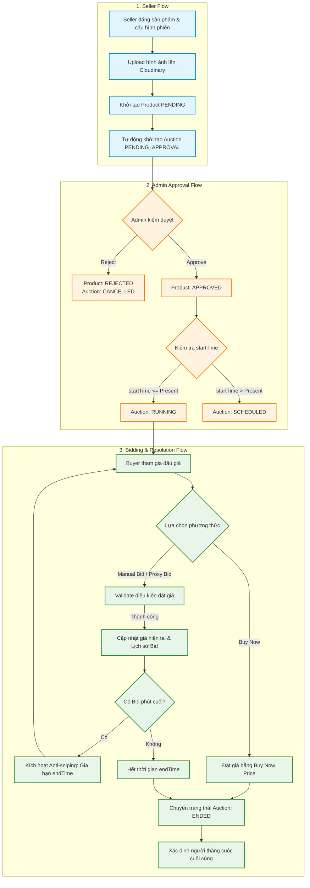
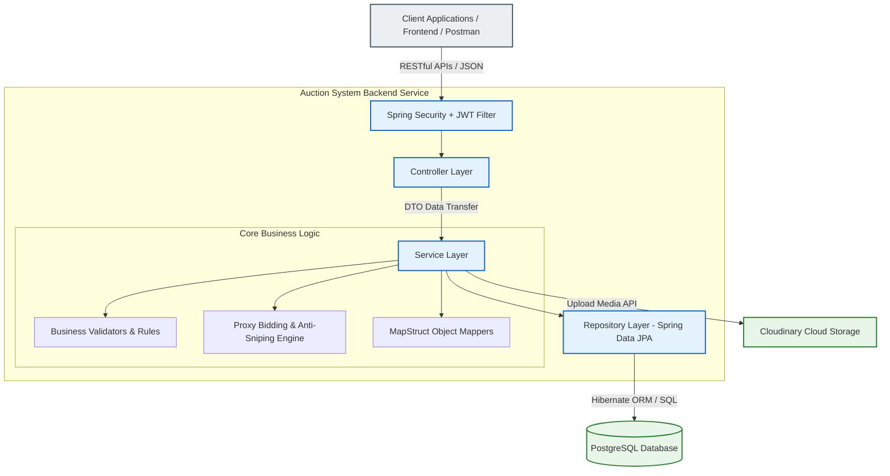
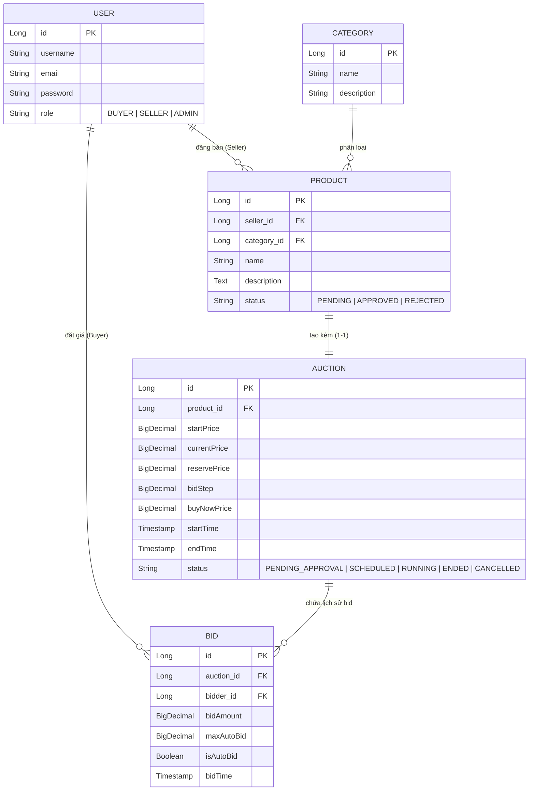

# 🔨 Auction System Backend

[](https://www.oracle.com/java/)
[](https://spring.io/projects/spring-boot)
[](https://www.postgresql.org/)
[](https://cloudinary.com/)
[](LICENSE)

Backend RESTful Service phục vụ nền tảng đấu giá trực tuyến doanh nghiệp (**Auction System**). Hệ thống hỗ trợ thương mại điện tử chuyên biệt cho các phiên đấu giá cạnh tranh, đảm bảo tính minh bạch, công bằng, bảo mật và khả năng xử lý thời gian thực.

---

## 📋 Table of Contents

- [1. Project Overview](#1-project-overview)
- [2. Problem Statement](#2-problem-statement)
- [3. Business Workflow](#3-business-workflow)
- [4. Main Features](#4-main-features)
- [5. System Architecture](#5-system-architecture)
- [6. Technology Stack](#6-technology-stack)
- [7. Project Structure](#7-project-structure)
- [8. Database Overview](#8-database-overview)
- [9. Installation \& Setup](#9-installation--setup)
- [10. Environment Variables](#10-environment-variables)
- [11. Running Project](#11-running-project)
- [12. Testing](#12-testing)
- [13. Future Improvements](#13-future-improvements)
- [14. Author](#14-author)

---

## 🎯 1. Project Overview

**Auction System Backend** được thiết kế nhằm cung cấp nền tảng xử lý toàn bộ nghiệp vụ đấu giá trực tuyến. Nền tảng kết nối người bán (Seller), người mua (Buyer) và quản trị viên (Admin) trên cùng một hệ sinh thái nhất quán.

Khi người bán đăng tải một sản phẩm lên hệ thống, một phiên đấu giá tương ứng sẽ tự động được khởi tạo. Thông qua quy trình kiểm duyệt nghiêm ngặt từ Admin, phiên đấu giá sẽ được kích hoạt để người mua tham gia đặt giá công khai với các cơ chế đấu giá thông minh như **Đấu giá tự động (Proxy Bidding)**, **Chống bắn lén phút cuối (Anti-sniping)** và **Mua ngay (Buy Now)**.

---

## 💡 2. Problem Statement

Đấu giá trực tuyến truyền thống thường gặp phải các thách thức lớn về mặt kỹ thuật và vận hành:

1. **Thiếu minh bạch & Rủi ro hàng giả / hàng kém chất lượng**: Người bán tự do đăng bài mà không qua kiểm duyệt có thể dẫn đến lừa đảo hoặc thông tin không chính xác.
   👉 *Giải pháp*: Quy trình kiểm duyệt bắt buộc (Admin Approval) trước khi sản phẩm và phiên đấu giá được công khai.

2. **Tốn thời gian theo dõi liên tục**: Người mua phải canh chừng phiên đấu giá liên tục để nâng giá khi bị người khác vượt qua.
   👉 *Giải pháp*: Tính năng **Proxy Bidding (Auto Bid)** tự động đặt giá thay mặt người mua theo mức ngân sách tối đa đặt trước.

3. **Hiện tượng "Bắn lén" phút cuối (Auction Sniping)**: Người tham gia chờ đến những giây cuối cùng mới đặt giá khiến phiên đấu giá kết thúc không công bằng và không phản ánh đúng giá trị thực của sản phẩm.
   👉 *Giải pháp*: Cơ chế **Anti-sniping** tự động gia hạn thời gian kết thúc phiên đấu giá nếu phát hiện lượt đặt giá mới trong khoảng thời gian sát giờ G.

4. **Quản lý đa phương tiện và dữ liệu nhất quán**: Cần lưu trữ lượng lớn hình ảnh chất lượng cao và đảm bảo tính toàn vẹn dữ liệu giao dịch đặt giá.
   👉 *Giải pháp*: Tích hợp mượt mà với **Cloudinary CDN** để lưu trữ hình ảnh và cơ sở dữ liệu quan hệ **PostgreSQL** đảm bảo các giao dịch ACID.

---

## 🔄 3. Business Workflow

Sơ đồ thể hiện luồng di chuyển nghiệp vụ từ lúc Người bán đăng sản phẩm đến khi xác định Người thắng cuộc hoặc Mua ngay:



---

## ✨ 4. Main Features

### 🛍️ Người bán (Seller)
- **Đăng bán sản phẩm**: Khởi tạo bài đăng sản phẩm cùng thông tin chi tiết và danh mục tương ứng.
- **Upload hình ảnh đa phương tiện**: Hỗ trợ tải lên nhiều hình ảnh chất lượng cao lên bộ lưu trữ mây Cloudinary.
- **Tự động gắn liền phiên đấu giá**: Cấu hình các thông số phiên đấu giá: giá khởi điểm (`startPrice`), bước giá (`bidStep`), giá mua ngay (`buyNowPrice`), thời gian bắt đầu & kết thúc.
- **Quản lý sản phẩm & Phiên đấu giá**: Theo dõi danh sách sản phẩm cá nhân, cập nhật thông tin bài đăng hoặc hủy bỏ khi phiên đấu giá chưa diễn ra.

### 🔨 Người mua (Buyer)
- **Khám phá sản phẩm**: Tìm kiếm, lọc sản phẩm theo danh mục, trạng thái phiên và thời gian.
- **Đấu giá thông thường (Manual Bidding)**: Đặt giá cạnh tranh trực tiếp theo bước giá cho phép.
- **Đấu giá tự động (Proxy Bidding / Auto Bid)**: Đặt mức giá tối đa chấp nhận trả (`maxAutoBid`). Hệ thống sẽ tự động tăng giá tối thiểu vừa đủ để giữ vị trí dẫn đầu cho đến khi đạt ngưỡng thiết lập.
- **Mua ngay (Buy Now)**: Sở hữu sản phẩm ngay lập tức tại mức giá Buy Now mà không cần chờ phiên kết thúc.
- **Tra cứu lịch sử đấu giá**: Xem danh sách chi tiết các lượt bid theo thời gian thực để đưa ra chiến lược phù hợp.

### 🛡️ Quản trị viên (Admin)
- **Kiểm duyệt bài đăng (Content Moderation)**: Duyệt (`Approve`) hoặc Từ chối (`Reject`) bài đăng đăng ký từ Seller.
- **Quản lý vòng đời phiên đấu giá**: Kiểm soát trạng thái vận hành của các phiên trên toàn hệ thống (`PENDING_APPROVAL`, `SCHEDULED`, `RUNNING`, `ENDED`, `CANCELLED`).

### ⚙️ Hệ thống tự động (System Features)
- **Thuật toán Proxy Bidding**: Tự động tính toán và nâng giá cạnh tranh cho người dùng đặt Auto Bid.
- **Cơ chế Anti-sniping**: Tự động phát hiện lượt đặt giá sát giờ kết thúc và gia hạn thời gian phiên đấu giá để đảm bảo công bằng.
- **Ràng buộc nghiệp vụ (Validation Rules)**: Đảm bảo Seller không thể tự đấu giá sản phẩm của chính mình, người mua đặt giá tuân thủ bước giá quy định, và chỉ các phiên `RUNNING` mới được phép đặt giá.
- **Tích hợp Cloudinary Storage**: Tự động xử lý và tối ưu hóa đường dẫn CDN cho hình ảnh sản phẩm.

---

## 🏗️ 5. System Architecture

Hệ thống được thiết kế theo kiến trúc layered (phân tầng chuẩn doanh nghiệp), giúp tách biệt rõ ràng giữa các tầng giao tiếp Client, xử lý logic nghiệp vụ và truy vấn dữ liệu:



---

## 🛠️ 6. Technology Stack

| Tầng / Hạng mục | Công nghệ sử dụng | Mô tả & Vai trò |
| :--- | :--- | :--- |
| **Language** | Java 17 | Nền tảng ngôn ngữ LTS hiện đại, hiệu năng cao. |
| **Framework** | Spring Boot 3 | Framework cốt lõi xây dựng ứng dụng Backend REST API. |
| **Security** | Spring Security & JWT | Xác thực stateless, mã hóa mật khẩu BCrypt, phân quyền RBAC (`BUYER`, `SELLER`, `ADMIN`). |
| **Persistence / ORM** | Spring Data JPA & Hibernate | Ánh xạ đối tượng quan hệ, quản lý giao dịch và truy vấn CSDL. |
| **Database** | PostgreSQL | Cơ sở dữ liệu quan hệ mạnh mẽ, đảm bảo tính toàn vẹn dữ liệu giao dịch. |
| **Cloud Storage** | Cloudinary Java SDK | Lưu trữ và phân phối hình ảnh sản phẩm qua CDN. |
| **DTO Mapping** | MapStruct | Tự động sinh mã chuyển đổi giữa Entity và DTO tại thời điểm biên dịch. |
| **Boilerplate Reduction**| Lombok | Tự động sinh Getter, Setter, Builder và Constructors. |
| **Build Tool** | Apache Maven | Quản lý phụ thuộc và đóng gói ứng dụng. |
| **Testing** | JUnit 5, Mockito & JaCoCo | Khung kiểm thử đơn vị, giả lập đối tượng và đo lường độ phủ mã nguồn. |

---

## 📂 7. Project Structure

Mã nguồn dự án được tổ chức cấu trúc package sạch sẽ theo từng trách nhiệm nghiệp vụ chuyên biệt:

```text
com.example.DuAnTrainning
├── config                  # Cấu hình Spring Security, JWT Auth, Cloudinary Beans
├── controller              # Các REST API Controller nhận Request và trả về Response
├── service                 # Giao diện & Đóng gói toàn bộ Logic nghiệp vụ của hệ thống
├── repository              # Giao diện Spring Data JPA tương tác với PostgreSQL
├── entity                  # Các Lớp JPA Entity ánh xạ với bảng CSDL
├── dto                     # Data Transfer Objects (Request & Response models)
│   ├── request
│   └── response
├── mapper                  # Cấu hình MapStruct ánh xạ Entity <-> DTO
├── validator               # Các Custom Annotation & Validator kiểm tra ràng buộc
├── exception               # Xử lý ngoại lệ tập trung (Global Exception Handler)
└── helper                  # Đơn vị tiện ích bổ trợ (Security Context, Date formatting,...)
```

---

## 🗄️ 8. Database Overview

Sơ đồ ERD thể hiện mối quan hệ chính giữa các bảng trong CSDL PostgreSQL:



---

## ⚙️ 9. Installation & Setup

Để cài đặt và khởi chạy dự án trên máy cục bộ, bạn cần chuẩn bị môi trường sau:

### Yêu cầu tiên quyết (Prerequisites)
- **Java Development Kit (JDK)**: Phiên bản 17 hoặc 21.
- **PostgreSQL**: Phiên bản 15 trở lên.
- **Apache Maven**: Phiên bản 3.8+ (hoặc dùng Maven Wrapper `mvnw` tích hợp sẵn).
- **Tài khoản Cloudinary**: Lấy thông tin `Cloud Name`, `API Key`, `API Secret`.

### Các bước chuẩn bị

1. **Clone mã nguồn dự án**:
   ```bash
   git clone https://github.com/your-username/AuctionSystem.git
   cd AuctionSystem/Backend/DuAnTrainning
   ```

2. **Khởi tạo Cơ sở dữ liệu**:
   Tạo mới một Database trống trong PostgreSQL:
   ```sql
   CREATE DATABASE auction_system;
   ```

3. **Cấu hình biến môi trường**:
   Tạo file `.env` tại thư mục gốc của project backend (`DuAnTrainning/.env`) với nội dung mẫu bên dưới.

---

## 🔑 10. Environment Variables

Các thông số cấu hình môi trường được khai báo trong file `.env` để bảo mật thông tin nhạy cảm:

| Biến môi trường | Giá trị mẫu | Giải thích |
| :--- | :--- | :--- |
| `PORT` | `8080` | Cổng dịch vụ Backend chạy |
| `SPRING_DATASOURCE_URL` | `jdbc:postgresql://localhost:5432/auction_system` | Đường dẫn kết nối CSDL PostgreSQL |
| `SPRING_DATASOURCE_USERNAME` | `postgres` | Tài khoản truy cập PostgreSQL |
| `SPRING_DATASOURCE_PASSWORD` | `123456` | Mật khẩu truy cập PostgreSQL |
| `CLOUDINARY_CLOUD_NAME` | `dmyrfnxfv` | Cloud Name ứng dụng trên Cloudinary |
| `CLOUDINARY_API_KEY` | `567893817722166` | API Key kết nối dịch vụ Cloudinary |
| `CLOUDINARY_API_SECRET` | `UXEZV0sENuJ1caxccS8P9H2dbCU` | API Secret kết nối dịch vụ Cloudinary |
| `JWT_SECRET` | `404E635266556A586E3272357538782F4...` | Chuỗi bí mật mã hóa JWT Token |
| `JWT_EXPIRATION_MS` | `86400000` | Thời gian hết hạn của Token (86400000 ms = 24 giờ) |

---

## 🚀 11. Running Project

### Chạy ứng dụng ở chế độ Development

Sử dụng Maven Wrapper để khởi chạy server Backend:

```bash
# Đối với Linux / macOS
./mvnw spring-boot:run

# Đối với Windows (CMD / PowerShell)
mvnw.cmd spring-boot:run
```

Sau khi ứng dụng khởi động xong, hệ thống REST API sẽ sẵn sàng tại địa chỉ:
`http://localhost:8080`

### Đóng gói ứng dụng (Production Build)

Đóng gói dự án thành file thực thi `.jar`:

```bash
./mvnw clean package -DskipTests
```

Chạy file ứng dụng đã được đóng gói:

```bash
java -jar target/DuAnTrainning-0.0.1-SNAPSHOT.jar
```

---

## 🧪 12. Testing

Dự án chú trọng đến chất lượng mã nguồn thông qua việc viết Unit Test và Integration Test kiểm thử các kịch bản nghiệp vụ quan trọng (đặt giá, proxy bidding, anti-sniping, duyệt bài đăng).

### Chạy toàn bộ Test suite:
```bash
./mvnw test
```

### Xuất báo cáo độ phủ mã nguồn (JaCoCo Report):
```bash
./mvnw clean test jacoco:report
```
Sau khi lệnh chạy hoàn tất, mở file báo cáo giao diện đồ họa tại đường dẫn:
`target/site/jacoco/index.html` bằng trình duyệt web để xem chi tiết % độ phủ code.

---

## 🔮 13. Future Improvements

Các định hướng phát triển và tối ưu hóa hệ thống trong các phiên bản tiếp theo:

- ⚡ **WebSocket & STOMP Protocol**: Cập nhật giá đấu thời gian thực (Real-time Live Bidding) cho tất cả client đang xem phiên mà không cần Polling API.
- 🔴 **Redis Integration (Caching & Distributed Lock)**:
  - Cache thông tin sản phẩm hot nhằm giảm tải cho CSDL.
  - Sử dụng Redlock xử lý tranh chấp (Concurrency) khi hàng ngàn lượt bid xảy ra trong cùng một giây.
- ⏰ **Dynamic Task Scheduling**: Tự động kích hoạt/kết thúc các phiên đấu giá chính xác theo milisecond dựa trên Spring Scheduler / Quartz.
- 💳 **Tích hợp Cổng thanh toán**: Hỗ trợ đặt cọc (Deposit) và thanh toán hóa đơn sau khi thắng đấu giá qua **VNPay**, **MoMo** hoặc **Stripe**.
- 📧 **Hệ thống thông báo (Notification System)**: Tự động gửi Email/SMS khi người dùng bị vượt giá (Outbid) hoặc khi phiên đấu giá kết thúc.

---

