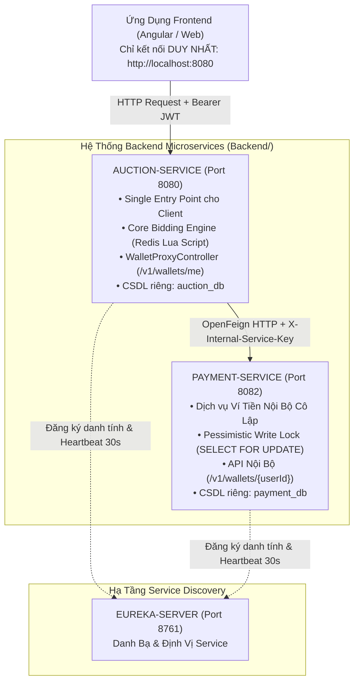

# 🌟 AUCTION SYSTEM - BACKEND MONOREPO ARCHITECTURE

Chào mừng bạn đến với **Hệ Thống Backend Đấu Giá Trực Tuyến (Microservices Monorepo)**. 

Dự ánBackend được tổ chức theo mô hình **Monorepo (Multi-module Architecture)** phân tách ranh giới nghiệp vụ (Bounded Context) rõ ràng, sử dụng **Spring Cloud Netflix Eureka** để phát hiện dịch vụ và **OpenFeign** giao tiếp nội bộ an toàn.

---

## 🏗️ 1. Cấu Trúc Thư Mục Monorepo

```text
Backend/
├── eureka-server/     # Port 8761: Trạm Đăng Ký & Định Vị Dịch Vụ Trung Tâm (Eureka Registry)
├── auction-service/   # Port 8080: Core Auction Engine, Đơn Hàng & Gateway Proxy Ủỷ Quyền
└── payment-service/   # Port 8082: Dịch Vụ Ví Tiền Ảo & Sổ Cái Tài Chính (Ẩn Nội Bộ)
```

---

## 🔌 2. Bảng Phân Cấp & Vai Trò Dịch Vụ

| Tên Dịch Vụ | Cổng (Port) | Vai Trò & Nghiệp Vụ Chính | Giao Tiếp & Bảo Mặt |
| :--- | :---: | :--- | :--- |
| **`eureka-server`** | `8761` | **Service Discovery Registry**: Nhận đăng ký danh tính động (Heartbeat 30s) từ các microservices. | Dashboard: `http://localhost:8761` |
| **`auction-service`** | `8080` | **Core Engine & Single Entry Point**: Tiếp nhận 100% request từ Frontend (Port 8080). Động cơ thầu Redis Lua Script (0.02ms), Quản lý Đơn hàng, Robot Scheduler 10s, Proxy API xem ví. | Xác thực JWT Bearer Token, gửi OpenFeign kèm Header `X-Internal-Service-Key` sang `payment-service`. |
| **`payment-service`** | `8082` | **Virtual Wallet & Escrow Ledger**: Quản lý số dư ví (`balance`), tạm giữ tiền Escrow, giải ngân cho Seller, chống trừ tiền trùng bằng Idempotency-Key. | **Ẩn hoàn toàn khỏi Internet**. Bảo vệ 100% bằng Header `X-Internal-Service-Key`. DB riêng `payment_db`. |

---

## 🎨 3. Sơ Đồ Kiến Trúc Luồng Dữ Liệu (Architecture Flowchart)



---

## 🚀 4. Hướng Dẫn Khởi Chạy Theo Tuần Tự (Startup Order)

Để hệ thống hoạt động chính xác, vui lòng khởi chạy 3 microservices theo đúng thứ tự sau:

### **Bước 1: Khởi chạy Eureka Server (Port 8761)**
```bash
cd Backend/eureka-server
./mvnw spring-boot:run
```
👉 *Kiểm tra Dashboard đã sống tại: `http://localhost:8761`*

### **Bước 2: Khởi chạy Payment Service (Port 8082)**
```bash
cd Backend/payment-service
./mvnw spring-boot:run
```
👉 *`PAYMENT-SERVICE` sẽ tự động đăng ký danh tính lên Eureka Server.*

### **Bước 3: Khởi chạy Auction Service (Port 8080 - Single Entry Point)**
```bash
cd Backend/auction-service
./mvnw spring-boot:run
```
👉 *`AUCTION-SERVICE` sẽ đăng ký lên Eureka và sẵn sàng tiếp nhận request từ Frontend.*

---

## 🛡️ 5. Nguyên Tắc Bảo Mặt Nội Bộ (Inter-Service Security)

1. **Client-to-Server**: Frontend chỉ kết nối tới Port 8080 (`auction-service`). Mọi request bắt buộc gửi Header `Authorization: Bearer <JWT_TOKEN>`.
2. **Server-to-Server**: `auction-service` gọi `payment-service` qua OpenFeign. `FeignConfig` sẽ tự động bơm Header bí mật:
   ```http
   X-Internal-Service-Key: AuctionPaymentInternalSecretKey2026!@#
   ```
3. **`payment-service`** áp dụng `InternalServiceSecurityFilter` bảo vệ 100% API. Nếu thiếu hoặc sai Header này, request lập tức bị ngắt với HTTP 403 Forbidden.

---

## 📜 6. Chi Tiết Tài Liệu Các Dịch Vụ
- 📘 [Tài liệu Chi tiết `auction-service`](file:///home/duong/Projects/Backend/auction-service/README.md)
- 📗 [Tài liệu Chi tiết `payment-service`](file:///home/duong/Projects/Backend/payment-service/README.md)
- 📙 [Tài liệu Chi tiết `eureka-server`](file:///home/duong/Projects/Backend/eureka-server/README.md)
