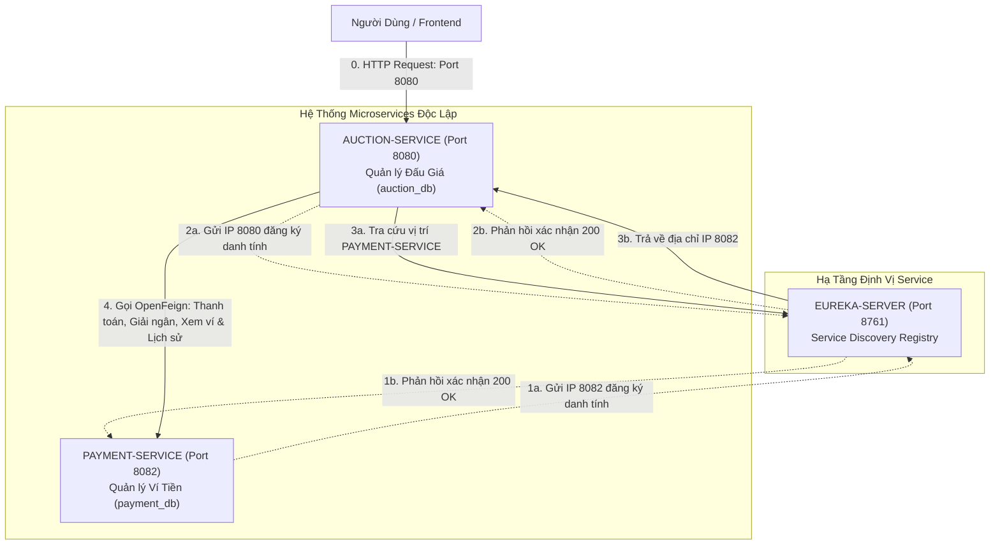
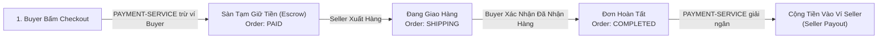
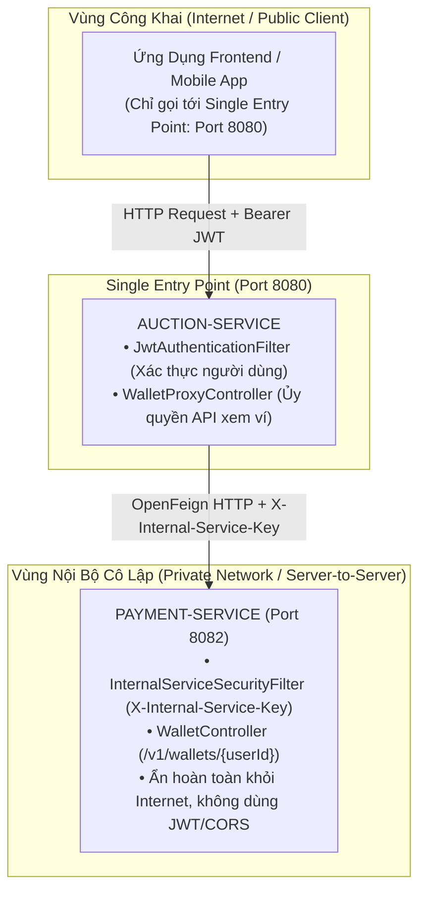

# TÀI LIỆU KIẾN TRÚC MICROSERVICES & TỰ PHỤC HỒI THANH TOÁN 

### 1.1. BÀI TOÁN THỰC TẾ 

#### Kiến trúc Đơn khối (Monolith Architecture Problems)
Toàn bộ hệ thống Đấu giá (xem sản phẩm, đặt giá bid, quản lý đơn hàng, ví tiền, trừ tiền thanh toán) nằm chung trong 1 ứng dụng Java duy nhất (Monolith) và 1 Cơ sở dữ liệu duy nhất. Khi số lượng người dùng truy cập tăng cao, kiến trúc đơn khối bộc lộ 3 điểm yếu tử huyệt:

1. **Rủi ro Sập dây chuyền toàn bộ hệ thống (Single Point of Failure)**: Khi 10,000+ người dùng cùng tập trung bấm Đặt giá (`placeBid`) giật giờ chót của một phiên thầu hot, lưu lượng request tăng vọt khiến CPU/RAM của Java Monolith chạm 100%. Nếu ứng dụng sập ➔ **Cổng Ví tiền & Thanh toán bị sập theo luôn**, người dùng không thể checkout hay nạp tiền, toàn bộ hoạt động tài chính bị đóng băng.
2. **Rủi ro An toàn & Bảo mật Tài chính (Security Isolation)**: Mã nguồn quản lý tài khoản Ví tiền (số dư `balance`, sổ cái giao dịch) nằm chung dự án với mã nguồn đăng bài sản phẩm public. Một lỗ hổng bảo mật ở tính năng xem bài đăng có thể dẫn tới việc bị khai thác tràn quyền đọc/sửa dữ liệu số dư ví.
3. **Bài toán Tải trọng Độc lập (Independent Scalability)**: Nghiệp vụ Đấu giá (`auction-service`) có tần suất ghi/đọc cực cao (hàng ngàn request/giây khi thầu), trong khi Nghiệp vụ Ví tiền (`payment-service`) có tần suất truy vấn ít hơn nhưng đòi hỏi độ chính xác tuyệt đối và khóa dữ liệu nghiêm ngặt (`SELECT FOR UPDATE`). Tách riêng giúp ta nâng cấp tài nguyên RAM/CPU cho từng service theo nhu cầu thực tế mà không lãng phí.

#### Giải pháp Kiến trúc Microservices Phân tách 3 Dịch vụ
Hệ thống được chia thành **3 ứng dụng hoàn toàn độc lập với phân định ranh giới nghiệp vụ (Bounded Context) rõ ràng**:



---

### 1.2. BẢNG PHÂN ĐỊNH CHI TIẾT VAI TRÒ & NGUYÊN LÝ HOẠT ĐỘNG CỦA 3 DỊCH VỤ

| Dịch vụ (Microservice) | Cổng (Port) | Vai trò & Nhiệm vụ Chi tiết (Dịch vụ làm gì?) | Nguyên lý Kỹ thuật Chi tiết (Làm như thế nào?) |
| :---| :---:| :---| :---|
| **`eureka-server`** | `8761` | **Trạm Đăng ký & Định vị Dịch vụ Trung tâm (Service Discovery Registry)**<br>• Quản lý danh bạ địa chỉ IP/Port động của các microservice.<br>• Nhận diện trạng thái sống/chết qua nhịp tim Heartbeat 30s/lần. | • Các service khi bootup tự động đăng ký danh tính sang Eureka (`eureka.client.register-with-eureka=true`).<br>• Khi `auction-service` cần gọi `payment-service`, nó không hardcode URL `http://localhost:8082`, mà gọi tên dịch vụ `http://PAYMENT-SERVICE`. Eureka sẽ tự động giải mã thành IP thực tế.<br>• Định kỳ 30s, Eureka nhận HTTP Heartbeat. Nếu quá 90s không nhận được tín hiệu, Eureka gạch tên service đó khỏi registry để ngắt lưu lượng. |
| **`auction-service`** | `8080` | **Sàn Đấu Giá Chính, Quản lý Đơn hàng & Gateway Ủy Quyền (Core Engine & Proxy)**<br>• Cổng tiếp nhận DUY NHẤT (Single Entry Point) cho Frontend.<br>• Quản lý danh mục, bài đăng sản phẩm, đính kèm ảnh Cloudinary CDN.<br>• Động cơ thầu thời gian thực: So kè giá nguyên tử Redis Lua Script (0.02ms), Proxy Bidding, Hard-close hết giờ.<br>• Vòng đời đơn hàng (`UNPAID` ➔ `PAID` ➔ `SHIPPING` ➔ `COMPLETED` \| `CANCELLED`).<br>• `WalletProxyController`: Đón request xem ví `/v1/wallets/me` từ Frontend, xác thực JWT và ủy quyền gọi `payment-service`.<br>• Robot `AuctionScheduler` 10s/lần: Tự động kích hoạt phiên, chốt winner, retry thanh toán 50 đơn/lượt, hủy đơn bùng 48h & phạt 3 gậy. | • Tiếp nhận request từ Client, kiểm tra quyền JWT và validate điều kiện kinh doanh.<br>• Khi Buyer bấm Checkout hoặc xem Ví ➔ Gọi `PaymentFeignClient` sang `PAYMENT-SERVICE` via Eureka kèm Header `X-Internal-Service-Key`.<br>• Khi Order chuyển sang `COMPLETED` ➔ Gọi `PaymentFeignClient.disbursePayment(...)` giải ngân cộng tiền cho Seller.<br>• Phân tách Fallback Circuit Breaker: Ném `ApplicationException` HTTP 503 khi xem ví bị sập; Gia hạn 24h & retry ngầm khi thanh toán trừ tiền bị sập. |
| **`payment-service`** | `8082` | **Dịch vụ Ví Tiền Ảo & Sổ Sách Tài Chính Nội Bộ (Escrow & Wallet Ledger)**<br>• Hoàn toàn ẩn khỏi Frontend (Private Network Server-to-Server).<br>• Quản lý số dư khả dụng (`balance`) của từng tài khoản Ví (`Wallet`).<br>• Xử lý trừ tiền ví Buyer khi Checkout (Tạm giữ Escrow) và giải ngân cộng tiền ví Seller khi đơn hoàn tất.<br>• Triệt tiêu trừ tiền 2 lần bằng `Idempotency-Key` nguyên tử.<br>• Cung cấp RESTful API nội bộ `/v1/wallets/{userId}` cho `auction-service` truy vấn. | • Sở hữu Database riêng biệt (`payment_db`), độc lập 100% với `auction-service`.<br>• Áp dụng Khóa hàng Pessimistic Lock (`SELECT ... FOR UPDATE`) để chặn Race Condition khi 2 request trừ tiền diễn ra cùng millisecond.<br>• Áp dụng **Bảo mật Nội bộ 100% (X-Internal-Service-Key)** qua `InternalServiceSecurityFilter` (Constant-Time comparison).<br>• Loại bỏ hoàn toàn JWT/CORS thừa vì không tiếp nhận kết nối trực tiếp từ trình duyệt. |

---


## 2. MÔ HÌNH TẠM GIỮ TIỀN (ESCROW) & GIẢI NGÂN CHO NGƯỜI BÁN (SELLER PAYOUT)

Trong sàn đấu giá, **Tiền không được cộng ngay cho Người bán khi Người mua vừa thanh toán**. Hệ thống áp dụng **Mô hình Tạm Giữ Tiền (Escrow Model)** chuẩn e-Commerce:



### 🔹 Giai đoạn 1: Khi Người mua Checkout (`PAID`)
* `PAYMENT-SERVICE` trừ tiền trong Ví người mua.
* Số tiền này **nằm ở Tài khoản Trung gian của Sàn (Tạm giữ)**.
* **Lý do**: Người bán chưa giao hàng. Nếu cộng ngay cho Người bán, nhỡ Người bán ôm tiền không giao hàng hoặc giao hàng giả thì Người mua sẽ bị mất trắng.

### 🔹 Giai đoạn 2: Khi Đơn hàng Hoàn tất (`COMPLETED` -> Giải ngân cho Seller)
* Người bán giao hàng (`SHIPPING`) ➔ Người mua nhận được hàng ➔ Người mua bấm **"Xác nhận đã nhận hàng thành công"** (`confirmReceived` ➔ Order đổi thành `COMPLETED`).
* `AUCTION-SERVICE` gọi API / gửi sự kiện sang `PAYMENT-SERVICE`.
* `PAYMENT-SERVICE` thực hiện **Giải ngân (Payout)**: Lấy tiền đang tạm giữ **CỘNG VÀO VÍ CỦA SELLER** (sau khi trừ % phí sàn).

---

## 3.KỊCH BẢN THỰC TẾ & LUỒNG XỬ LÝ CHI TIẾT (STEP-BY-STEP FLOWS)

### Kịch bản 1: Thanh toán Bình thường (Thành công 100%)
* **Bối cảnh**: Người mua trúng thầu đơn hàng 5.000.000đ. Ví của người mua có 10.000.000đ. Hệ thống chạy bình thường.
* **Luồng chạy**:
  1. Người mua bấm nút **"Thanh toán"**.
  2. `AUCTION-SERVICE` tạo `Idempotency-Key` duy nhất (ví dụ: `PAY_ORDER_10_USER_5`) và gọi sang `PAYMENT-SERVICE` qua OpenFeign.
  3. `PAYMENT-SERVICE` kiểm tra ví đủ tiền ➔ Trừ 5.000.000đ ➔ Trả về `PaymentStatus.SUCCESS`.
  4. `AUCTION-SERVICE` đổi trạng thái Đơn hàng thành **`PAID`** (Đã thanh toán thành công).

---

### Kịch bản 2: Ví KHÔNG ĐỦ TIỀN (Lỗi Nghiệp Vụ Người Dùng)
* **Bối cảnh**: Đơn hàng 5.000.000đ nhưng ví người mua chỉ còn 1.000.000đ.
* **Luồng chạy**:
  1. Người mua bấm **"Thanh toán"**.
  2. `PAYMENT-SERVICE` kiểm tra thấy thiếu tiền ➔ Trả về HTTP 200 kèm status `INSUFFICIENT_BALANCE`.
  3. `AUCTION-SERVICE` hiển thị ngay thông báo lỗi cho người dùng: *"Ví không đủ tiền, vui lòng nạp thêm!"*.
  4. Đơn hàng **GIỮ NGUYÊN trạng thái `UNPAID`** (vẫn giữ thời hạn 48h ban đầu).
  5. **KHÔNG GIA HẠN 24H** (Vì đây là lỗi thiếu tiền của khách, không phải lỗi sập mạng).

---

### Kịch bản 3: PAYMENT-SERVICE bị Sập hoặc Mạng Chậm (Lỗi Hạ Tầng -> Phục Hồi Êm Ái)
* **Bối cảnh**: Cổng Ví tiền `PAYMENT-SERVICE` bị đứt cáp, đứt mạng hoặc bị nghẽn phản hồi quá 3 giây.
* **Luồng chạy**:
  1. Người mua bấm **"Thanh toán"**.
  2. Quá 3 giây không nhận được phản hồi ➔ **Resilience4j Circuit Breaker** lập tức ngắt mạch khẩn cấp.
  3. Kích hoạt hàm dự phòng **`PaymentFeignFallback`** ➔ Trả về status `PENDING_RETRY`.
  4. `AUCTION-SERVICE` đổi trạng thái Đơn hàng thành **`PAYMENT_PENDING_RETRY`** và **TỰ ĐỘNG CỘNG THÊM 24 GIỜ** vào hạn thanh toán.
  5. Phản hồi êm ái cho người mua: *"Dịch vụ ví đang bảo trì. Đơn hàng của bạn đã được tự động gia hạn 24h để thanh toán lại!"*.

---

### Kịch bản 4: Robot `AuctionScheduler` Tự Động Thử Lại Thanh Toán (Throttling 50 đơn/lần)
* **Bối cảnh**: Sau 5 phút sập mạng, `PAYMENT-SERVICE` đã sống lại. Lúc này có 200 đơn hàng đang ở trạng thái `PAYMENT_PENDING_RETRY`.
* **Luồng chạy**:
  1. Cứ mỗi **10 giây/lần**, Robot `AuctionScheduler` chạy ngầm.
  2. Robot xin CSDL tối đa **50 đơn hàng** `PAYMENT_PENDING_RETRY` cũ nhất (`PageRequest.of(0, 50)` để tránh nghẽn thread).
  3. Robot gọi `PAYMENT-SERVICE` thanh toán bù cho từng đơn.
  4. Khi `PAYMENT-SERVICE` trả về `SUCCESS` ➔ Robot tự động chuyển đơn thành **`PAID`** mà người mua không cần làm gì thêm!

---

### Kịch bản 5: Hết hạn 24h / 48h & Phạt Gậy Công Bằng (Business Fairness)
* **Bối cảnh**: Hết thời hạn mà đơn hàng vẫn chưa được thanh toán thành công.
* **Quy tắc Xử phạt Công bằng**:
  - **Trường hợp A (Đơn `UNPAID` quá 48h)**: Cho 48h mạng mỡ bình thường mà khách **cố tình không trả tiền** ➔ Hủy đơn & **PHẠT +1 GẬY** (Tích đủ 3 gậy sẽ bị khóa tài khoản 90 ngày).
  - **Trường hợp B (Đơn `PAYMENT_PENDING_RETRY` quá 24h)**: Khách **đã bấm trả tiền**, nhưng do `PAYMENT-SERVICE` bị sập 24h liên tục ➔ Hủy đơn nhưng **MIỄN PHẠT GẬY** (Do lỗi hệ thống, không phải lỗi người mua).

---

## 3. CƠ CHẾ BẢO VỆ CHỐNG BỌ / LỖI DỮ LIỆU THỰC TẾ

| STT | Tên Cơ chế Bảo vệ | Vấn đề Thực tế Nếu Không Có | Cách Giải quyết Đã Triển khai trong Code |
| :---: | :---| :---| :---|
| **1** | **Root White-list State Guard** | Một đơn hàng đã bị hủy (`CANCELLED`) do hết hạn, nhưng 1 response thanh toán thành công trả về muộn lại **"Hồi sinh"** đơn thành `PAID`. | Đặt Guard ngay đầu `OrderPaymentTxHelper`: Nếu đơn đã `CANCELLED`, `PAID`, `SHIPPING` hay `COMPLETED` ➔ **Ngắt ngầm 100%**, không cho phép ghi đè Order hay Payment! |
| **2** | **Tái sử dụng Bản ghi `Payment`** | Mỗi lần Robot 10s retry thành công lại `new Payment()` mới ➔ 1 đơn hàng bị lưu 2-3 dòng Payment trùng lặp trong DB. | Dùng `paymentRepository.findByOrder_Id(order.getId())` lấy bản ghi cũ ra để cập nhật từ `PENDING` thành `SUCCESS`. |
| **3** | **Bảo vệ State Machine Payment 1 Chiều** | Trạng thái Payment đang `SUCCESS` bị 1 request trễ cập nhật ngược về `PENDING`. | Nếu `payment.getStatus() == SUCCESS`, giữ nguyên `SUCCESS` vĩnh viễn, không cho phép lùi trạng thái. |
| **4** | **Phân tách DB Transaction** | Đưa lệnh gọi Feign HTTP (chờ 3s) vào trong `@Transactional` ➔ Làm cạn kiệt DB Connection Pool (HikariCP) gây sập cả hệ thống. | Bỏ `@Transactional` ở hàm gọi Feign. Chỉ mở Transaction trong `OrderPaymentTxHelper` khi ghi CSDL. |
| **5** | **Tính Nguyên tử khi Hủy đơn (Atomic Expiration)** | Đơn hàng thì bị hủy nhưng người mua chưa kịp bị phạt gậy do server bị ngắt điện giữa chừng. | Bọc hàm `cancelExpiredOrderAndPenalizeBuyer` trong 1 DB Transaction riêng biệt. |

---

## 4. BẢNG TRA CỨU MÃ NGUỒN (CODE CATALOG)

| Tên File Code | Đường dẫn Chi tiết | Nhiệm vụ Chính trong Hệ thống |
| :---| :---| :---|
| [OrderPaymentTxHelper.java](file:///home/duong/Projects/Backend/auction-service/src/main/java/com/duong/auction/system/service/helper/OrderPaymentTxHelper.java) | `service/helper/OrderPaymentTxHelper.java` | Mở `@Transactional` ghi DB an toàn, bảo vệ Root State Guard 1 chiều, tái sử dụng Payment record. |
| [AuctionScheduler.java](file:///home/duong/Projects/Backend/auction-service/src/main/java/com/duong/auction/system/service/AuctionScheduler.java) | `service/AuctionScheduler.java` | Robot 10s/lần: Tự động kích hoạt phiên, chốt winner, retry 50 đơn/lần, hủy đơn & phạt gậy công bằng. |
| [OrderRepository.java](file:///home/duong/Projects/Backend/auction-service/src/main/java/com/duong/auction/system/repository/OrderRepository.java) | `repository/OrderRepository.java` | Chứa các câu query tìm đơn quá hạn 48h, đơn `PENDING_RETRY` kèm `Pageable` phân trang. |
| [PaymentRepository.java](file:///home/duong/Projects/Backend/auction-service/src/main/java/com/duong/auction/system/repository/PaymentRepository.java) | `repository/PaymentRepository.java` | Chứa query `findByOrder_Id` để tìm và tái sử dụng bản ghi Payment cũ. |
| [PaymentFeignClient.java](file:///home/duong/Projects/Backend/auction-service/src/main/java/com/duong/auction/system/client/PaymentFeignClient.java) | `client/PaymentFeignClient.java` | Khai báo OpenFeign Client gọi API trừ tiền ví sang `PAYMENT-SERVICE` via Eureka. |
| [PaymentFeignFallback.java](file:///home/duong/Projects/Backend/auction-service/src/main/java/com/duong/auction/system/client/PaymentFeignFallback.java) | `client/PaymentFeignFallback.java` | Hàm dự phòng khi `PAYMENT-SERVICE` sập: Trả về `PENDING_RETRY` & gia hạn 24h. |
| [OrderService.java](file:///home/duong/Projects/Backend/auction-service/src/main/java/com/duong/auction/system/service/OrderService.java) | `service/OrderService.java` | Tiếp nhận request Checkout từ Controller, gọi Feign ngoài Transaction. |

---

## 5. CHI TIẾT NỘI BỘ PAYMENT-SERVICE (AN TOÀN TÀI CHÍNH & CHỐNG TRÙNG LẶP ATOMIC)

Để đảm bảo số dư Ví tiền không bao giờ bị âm và giao dịch không bao giờ bị xử lý 2 lần (ngay cả khi có hàng nghìn request đồng thời), `PAYMENT-SERVICE` áp dụng 3 cơ chế kỹ thuật cốt lõi:

### 5.1. Khóa Dữ Liệu Đồng Thời (Pessimistic Write Locking - `SELECT ... FOR UPDATE`)
* **Vấn đề**: Nếu 2 request cùng đọc ví tiền người dùng đang có 5.000.000đ và cùng trừ 4.000.000đ tại cùng một thời điểm, ví sẽ bị mất 4.000.000đ và số dư cuối cùng thành 1.000.000đ thay vì 1.000.000đ và báo thiếu tiền (Race Condition / Lost Update).
* **Giải pháp**:
  ```java
  @Lock(LockModeType.PESSIMISTIC_WRITE)
  @Query("SELECT w FROM Wallet w WHERE w.userId = :userId")
  Optional<Wallet> findByUserIdForUpdate(@Param("userId") Long userId);
  ```
* **Luồng chạy**: Request đầu tiên chiếm khóa DB hàng (Row-level Lock). Request thứ hai phải **đứng chờ (Block)** cho đến khi Transaction của request đầu tiên thành công và Commit. Request hai đọc số dư mới 1.000.000đ và báo `INSUFFICIENT_BALANCE`.

### 5.2. Giải Quyết Lỗi Spring Self-Invocation Qua Bean `PaymentTxHelper`
* **Vấn đề**: Nếu gọi hàm bọc `@Transactional` từ một hàm khác trong cùng một Class (`this.processPaymentTransaction(...)`), Spring AOP Proxy sẽ bị qua mặt (Self-Invocation), dẫn đến `@Transactional` không có hiệu lực và khóa Pessimistic Lock bị nhả ra ngay lập tức!
* **Giải pháp**: Tách toàn bộ logic ghi DB và trừ tiền ra một Bean Spring riêng biệt `@Component PaymentTxHelper`. `PaymentService` sẽ gọi qua Bean trung gian này để đảm bảo Spring Proxy mở và đóng Transaction chuẩn xác.

### 5.3. Chống Trùng Lập 2 Lớp (Atomic Idempotency)
* **Lớp 1 (Fast-Path Check)**: Kiểm tra `paymentTransactionRepository.findByIdempotencyKey(...)`. Nếu đã tồn tại trong DB, trả về kết quả giao dịch cũ ngay lập tức (không trừ tiền lần 2).
* **Lớp 2 (Atomic DB Unique Constraint)**: Trong trường hợp 2 request gọi cùng `Idempotency-Key` chạm DB tại cùng 1 miligiây (qua mặt được Lớp 1), DB Unique Constraint `@Index(name = "idx_transaction_idempotency", columnList = "idempotency_key", unique = true)` sẽ ném ra `DataIntegrityViolationException`. `PaymentService` bắt ngoại lệ này, rollback transaction trùng và lấy kết quả giao dịch thành công trước đó trả về cho client.

---

## 6. KIẾN TRÚC BẢO MẬT & BẢO VỆ DỮ LIỆU CÁ NHÂN (SECURITY ARCHITECTURE SPEC)

---

### 6.1. MÔ HÌNH BẢO MẬT SINGLE ENTRY POINT & PHÂN TÁCH RANH GIỚI (BOUNDED CONTEXT)

Hệ thống được thiết kế theo chuẩn **Single Entry Point (Cổng tiếp nhận duy nhất)** giúp tối ưu hóa bảo mật và đơn giản hóa tích hợp Frontend:



---

### 6.2. NGUYÊN LÝ BẢO VỆ NỘI BỘ 100% TRONG PAYMENT-SERVICE

#### 1. Nguyên lý Hoạt động của `InternalServiceSecurityFilter`
* **File triển khai**: [`InternalServiceSecurityFilter.java`](file:///home/duong/Projects/Backend/payment-service/src/main/java/com/duong/auction/payment/security/InternalServiceSecurityFilter.java)
* **Quy trình Đánh Chặn (Intercept Flow)**:
  1. Kế thừa `OncePerRequestFilter`, áp dụng cho **100% endpoint** trong `payment-service` (trừ `/actuator/**` và `/error` dành cho Eureka Healthcheck).
  2. Trích xuất HTTP Header `X-Internal-Service-Key` từ Request gửi tới.
  3. **So sánh An toàn Thời gian Hằng số (Constant-Time Comparison)**: Sử dụng `MessageDigest.isEqual(...)` để triệt tiêu hoàn toàn nguy cơ tấn công đo thời gian (Timing Attack / Side-Channel Attack).
  4. **Xử lý vi phạm**: Nếu thiếu Header hoặc Key không khớp, trả về ngay HTTP 403 Forbidden (`UNAUTHORIZED_ACCESS`).

#### 2. Cấu hình 1 SecurityFilterChain Duy Nhất Trong [`PaymentSecurityConfig.java`](file:///home/duong/Projects/Backend/payment-service/src/main/java/com/duong/auction/payment/config/PaymentSecurityConfig.java)
* Loại bỏ hoàn toàn cấu hình CORS thừa (vì `payment-service` không tiếp nhận request trực tiếp từ trình duyệt).
* Loại bỏ toàn bộ `JwtAuthenticationFilter` và `JwtTokenProvider` ở `payment-service`.
* Đăng ký `InternalServiceSecurityFilter` làm bộ lọc bảo vệ duy nhất đứng trước `UsernamePasswordAuthenticationFilter`.

---

### 6.3. CƠ CHẾ TRIỆT TIÊU LỖ HỔNG IDOR / BOLA 100% QUA WALLET PROXY CONTROLLER

1. **Phía `auction-service` ([`WalletProxyController.java`](file:///home/duong/Projects/Backend/auction-service/src/main/java/com/duong/auction/system/controller/WalletProxyController.java))**:
   - Đón request `GET /v1/wallets/me` và `GET /v1/wallets/me/transactions` từ Frontend.
   - Bơm `@AuthenticationPrincipal UserCustomDetails userDetails` (đã được xác thực JWT bởi `auction-service`).
   - Rút `userId` chính chủ từ `userDetails.getUser().getId()`.
   - Gọi `paymentFeignClient.getWalletByUserId(userId)` và `paymentFeignClient.getTransactionHistory(userId)`.

2. **Phía `payment-service` ([`WalletController.java`](file:///home/duong/Projects/Backend/payment-service/src/main/java/com/duong/auction/payment/controller/WalletController.java))**:
   - Đón RESTful path `/v1/wallets/{userId}` và `/v1/wallets/{userId}/transactions` với `@PathVariable Long userId`.
   - **Đảm bảo An toàn 100%**: Vì `payment-service` nằm ở mạng nội bộ và đã được bảo vệ qua `X-Internal-Service-Key`, việc nhận `userId` từ Path hoàn toàn an toàn, người dùng từ Internet không thể gọi trực tiếp để khai thác lỗ hổng IDOR.

---

### 6.4. BẢNG MAPPING CHI TIẾT THÀNH PHẦN BẢO MẬT (SECURITY CODE MATRIX)

| Tên Thành Phần (Class Name) | Thư Mục / Đường Dẫn File | Vai Trò & Nhiệm Vụ Kỹ Thuật Chi Tiết |
| :---| :---| :---|
| **[`FeignConfig`](file:///home/duong/Projects/Backend/auction-service/src/main/java/com/duong/auction/system/config/FeignConfig.java)** | `auction-service/.../config/FeignConfig.java` | **Con Mộc Đóng Dấu Bí Mật**: Tự động chèn `X-Internal-Service-Key` vào mọi request Feign gửi sang `payment-service`. |
| **[`WalletProxyController`](file:///home/duong/Projects/Backend/auction-service/src/main/java/com/duong/auction/system/controller/WalletProxyController.java)** | `auction-service/.../controller/WalletProxyController.java` | **Trạm Ủy Quyền Ví Tiền**: Tiếp nhận `/v1/wallets/me` từ Frontend, rút `userId` từ JWT và gọi `PaymentFeignClient`. |
| **[`PaymentFeignClient`](file:///home/duong/Projects/Backend/auction-service/src/main/java/com/duong/auction/system/client/PaymentFeignClient.java)** | `auction-service/.../client/PaymentFeignClient.java` | **Feign Client Type-Safe**: Khai báo gọi API trừ tiền (`/v1/payments/...`) và API truy vấn ví (`/v1/wallets/{userId}`) chuẩn DTOs. |
| **[`PaymentFeignFallback`](file:///home/duong/Projects/Backend/auction-service/src/main/java/com/duong/auction/system/client/PaymentFeignFallback.java)** | `auction-service/.../client/PaymentFeignFallback.java` | **Circuit Breaker Fallback**: Gia hạn 24h & retry ngầm cho giao dịch trừ tiền; Ném `ApplicationException(HTTP 503)` cho API xem ví. |
| **[`InternalServiceSecurityFilter`](file:///home/duong/Projects/Backend/payment-service/src/main/java/com/duong/auction/payment/security/InternalServiceSecurityFilter.java)** | `payment-service/.../security/InternalServiceSecurityFilter.java` | **Bảo Vệ Gác Cổng Nội Bộ**: Kiểm tra `X-Internal-Service-Key` bằng Constant-Time comparison cho 100% endpoint. |
| **[`PaymentSecurityConfig`](file:///home/duong/Projects/Backend/payment-service/src/main/java/com/duong/auction/payment/config/PaymentSecurityConfig.java)** | `payment-service/.../config/PaymentSecurityConfig.java` | **Trưởng Ban Quản Lý Tòa Nhà**: Cấu hình 1 FilterChain duy nhất bảo vệ toàn bộ API nội bộ, loại bỏ CORS thừa. |
| **[`WalletController`](file:///home/duong/Projects/Backend/payment-service/src/main/java/com/duong/auction/payment/controller/WalletController.java)** | `payment-service/.../controller/WalletController.java` | **Giao Dịch Viên Ví Nội Bộ**: Tiếp nhận `/v1/wallets/{userId}`, đọc số dư ví từ `payment_db` trả về cho `auction-service`. |


