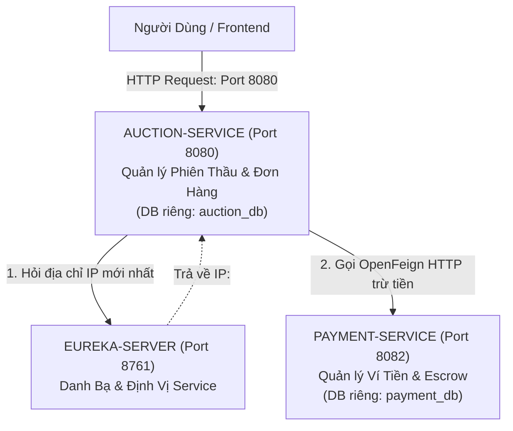
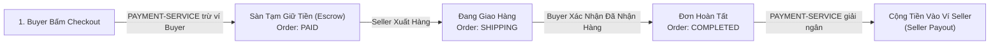
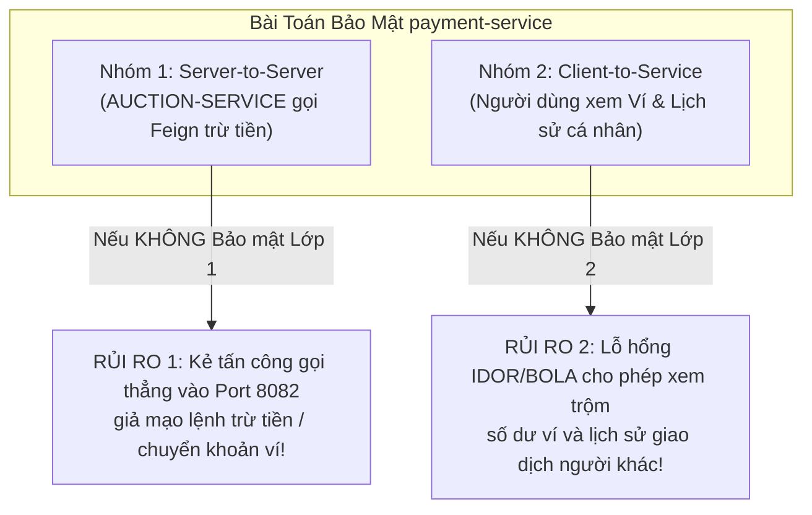

# TÀI LIỆU KIẾN TRÚC MICROSERVICES & TỰ PHỤC HỒI THANH TOÁN 

### 1.1. BÀI TOÁN THỰC TẾ 

#### Kiến trúc Đơn khối (Monolith Architecture Problems)
Toàn bộ hệ thống Đấu giá (xem sản phẩm, đặt giá bid, quản lý đơn hàng, ví tiền, trừ tiền thanh toán) nằm chung trong 1 ứng dụng Java duy nhất (Monolith) và 1 Cơ sở dữ liệu duy nhất. Khi số lượng người dùng truy cập tăng cao, kiến trúc đơn khối bộc lộ 3 điểm yếu tử huyệt:

1. **Rủi ro Sập dây chuyền toàn bộ hệ thống (Single Point of Failure)**: Khi 10,000+ người dùng cùng tập trung bấm Đặt giá (`placeBid`) giật giờ chót của một phiên thầu hot, lưu lượng request tăng vọt khiến CPU/RAM của Java Monolith chạm 100%. Nếu ứng dụng sập ➔ **Cổng Ví tiền & Thanh toán bị sập theo luôn**, người dùng không thể checkout hay nạp tiền, toàn bộ hoạt động tài chính bị đóng băng.
2. **Rủi ro An toàn & Bảo mật Tài chính (Security Isolation)**: Mã nguồn quản lý tài khoản Ví tiền (số dư `balance`, sổ cái giao dịch) nằm chung dự án với mã nguồn đăng bài sản phẩm public. Một lỗ hổng bảo mật ở tính năng xem bài đăng có thể dẫn tới việc bị khai thác tràn quyền đọc/sửa dữ liệu số dư ví.
3. **Bài toán Tải trọng Độc lập (Independent Scalability)**: Nghiệp vụ Đấu giá (`auction-service`) có tần suất ghi/đọc cực cao (hàng ngàn request/giây khi thầu), trong khi Nghiệp vụ Ví tiền (`payment-service`) có tần suất truy vấn ít hơn nhưng đòi hỏi độ chính xác tuyệt đối và khóa dữ liệu nghiêm ngặt (`SELECT FOR UPDATE`). Tách riêng giúp ta nâng cấp tài nguyên RAM/CPU cho từng service theo nhu cầu thực tế mà không lãng phí.

#### 🟢 Giải pháp Kiến trúc Microservices Phân tách 3 Dịch vụ
Hệ thống được chia thành **3 ứng dụng hoàn toàn độc lập với phân định ranh giới nghiệp vụ (Bounded Context) rõ ràng**:



---

### 1.2. BẢNG PHÂN ĐỊNH CHI TIẾT VAI TRÒ & NGUYÊN LÝ HOẠT ĐỘNG CỦA 3 DỊCH VỤ

| Dịch vụ (Microservice) | Cổng (Port) | Vai trò & Nhiệm vụ Chi tiết (Dịch vụ làm gì?) | Nguyên lý Kỹ thuật Chi tiết (Làm như thế nào?) |
| :---| :---:| :---| :---|
| **`eureka-server`** | `8761` | **Trạm Đăng ký & Định vị Dịch vụ Trung tâm (Service Discovery Registry)**<br>• Quản lý danh bạ địa chỉ IP/Port động của các microservice.<br>• Nhận diện trạng thái sống/chết qua nhịp tim Heartbeat 30s/lần. | • Các service khi bootup tự động đăng ký danh tính sang Eureka (`eureka.client.register-with-eureka=true`).<br>• Khi `auction-service` cần gọi `payment-service`, nó không hardcode URL `http://localhost:8082`, mà gọi tên dịch vụ `http://PAYMENT-SERVICE`. Eureka sẽ tự động giải mã thành IP thực tế.<br>• Định kỳ 30s, Eureka nhận HTTP Heartbeat. Nếu quá 90s không nhận được tín hiệu, Eureka gạch tên service đó khỏi registry để ngắt lưu lượng. |
| **`auction-service`** | `8080` | **Sàn Đấu Giá Chính & Quản lý Đơn hàng (Core Business Engine)**<br>• Quản lý danh mục, bài đăng sản phẩm, đính kèm ảnh Cloudinary CDN.<br>• Động cơ thầu thời gian thực: So kè giá nguyên tử Redis Lua Script (0.02ms), Proxy Bidding, Hard-close hết giờ.<br>• Vòng đời đơn hàng (`UNPAID` ➔ `PAID` ➔ `SHIPPING` ➔ `COMPLETED` \| `CANCELLED`).<br>• Robot `AuctionScheduler` 10s/lần: Tự động kích hoạt phiên, chốt winner, retry thanh toán 50 đơn/lượt, hủy đơn bùng 48h & phạt 3 gậy. | • Tiếp nhận request từ Client, kiểm tra quyền JWT và validate điều kiện kinh doanh.<br>• Khi Buyer bấm Checkout ➔ Gọi `paymentFeignClient.processPayment(...)` sang `PAYMENT-SERVICE` để thực hiện trừ tiền.<br>• Khi Order chuyển sang `COMPLETED` ➔ Gọi `paymentFeignClient.processPayout(...)` giải ngân cộng tiền cho Seller.<br>• Tích hợp Resilience4j Circuit Breaker để tự động gia hạn 24h nếu `PAYMENT-SERVICE` bị sập. |
| **`payment-service`** | `8082` | **Dịch vụ Ví Tiền Ảo & Sổ Sách Tài Chính (Escrow & Wallet Ledger)**<br>• Quản lý số dư khả dụng (`balance`) của từng tài khoản Ví (`Wallet`).<br>• Xử lý trừ tiền ví Buyer khi Checkout (Tạm giữ Escrow) và giải ngân cộng tiền ví Seller khi đơn hoàn tất.<br>• Triệt tiêu trừ tiền 2 lần bằng `Idempotency-Key` nguyên tử.<br>• Cung cấp API cá nhân `/v1/wallets/me` cho người dùng xem số dư ví chính chủ. | • Sở hữu Database riêng biệt (`payment_db`), độc lập 100% với `auction-service`.<br>• Áp dụng Khóa hàng Pessimistic Lock (`SELECT ... FOR UPDATE`) để chặn Race Condition khi 2 request trừ tiền diễn ra cùng millisecond.<br>• Áp dụng **Bảo mật 2 Lớp**: Lớp 1 chặn request ngoài bằng Header `X-Internal-Service-Key`; Lớp 2 xác thực JWT Claim `userId` (0ms SQL lookup) triệt tiêu 100% IDOR. |

---


## 2. MÔ HÌNH TẠM GIỮ TIỀN (ESCROW) & GIẢI NGÂN CHO NGƯỜI BÁN (SELLER PAYOUT)

Trong sàn đấu giá, **Tiền không được cộng ngay cho Người bán khi Người mua vừa thanh toán**. Hệ thống áp dụng **Mô hình Tạm Giữ Tiền (Escrow Model)** chuẩn e-Commerce:



### 🔹 Giai đoạn 1: Khi Người mua Checkout (`PAID`)
* `PAYMENT-SERVICE` trừ tiền trong Ví người mua.
* Số tiền này **nằm ở Tài khoản Trung gian của Sàn (Tạm giữ)**.
* **Lý do**: Người bán chưa giao hàng. Nếu cộng ngay cho Người bán, nhỡ Người bán ôm tiền không giao hàng hoặc giao hàng giả thì Người mua sẽ bị mất trắng.

### 🔹 Giai đoạn 2: Khi Đơn hàng Hoàn tất (`COMPLETED` -> Giải ngân cho Seller)
* Người bán giao hàng (`SHIPPING`) ➔ Người mua nhận được hàng ➔ Người mua bấm **"Xác nhận đã nhận hàng thành công"** (`confirmReceived` ➔ Order đổi thành `COMPLETED`).
* `AUCTION-SERVICE` gọi API / gửi sự kiện sang `PAYMENT-SERVICE`.
* `PAYMENT-SERVICE` thực hiện **Giải ngân (Payout)**: Lấy tiền đang tạm giữ **CỘNG VÀO VÍ CỦA SELLER** (sau khi trừ % phí sàn).

---

## 3.KỊCH BẢN THỰC TẾ & LUỒNG XỬ LÝ CHI TIẾT (STEP-BY-STEP FLOWS)

### Kịch bản 1: Thanh toán Bình thường (Thành công 100%)
* **Bối cảnh**: Người mua trúng thầu đơn hàng 5.000.000đ. Ví của người mua có 10.000.000đ. Hệ thống chạy bình thường.
* **Luồng chạy**:
  1. Người mua bấm nút **"Thanh toán"**.
  2. `AUCTION-SERVICE` tạo `Idempotency-Key` duy nhất (ví dụ: `PAY_ORDER_10_USER_5`) và gọi sang `PAYMENT-SERVICE` qua OpenFeign.
  3. `PAYMENT-SERVICE` kiểm tra ví đủ tiền ➔ Trừ 5.000.000đ ➔ Trả về `PaymentStatus.SUCCESS`.
  4. `AUCTION-SERVICE` đổi trạng thái Đơn hàng thành **`PAID`** (Đã thanh toán thành công).

---

### Kịch bản 2: Ví KHÔNG ĐỦ TIỀN (Lỗi Nghiệp Vụ Người Dùng)
* **Bối cảnh**: Đơn hàng 5.000.000đ nhưng ví người mua chỉ còn 1.000.000đ.
* **Luồng chạy**:
  1. Người mua bấm **"Thanh toán"**.
  2. `PAYMENT-SERVICE` kiểm tra thấy thiếu tiền ➔ Trả về HTTP 200 kèm status `INSUFFICIENT_BALANCE`.
  3. `AUCTION-SERVICE` hiển thị ngay thông báo lỗi cho người dùng: *"Ví không đủ tiền, vui lòng nạp thêm!"*.
  4. Đơn hàng **GIỮ NGUYÊN trạng thái `UNPAID`** (vẫn giữ thời hạn 48h ban đầu).
  5. **KHÔNG GIA HẠN 24H** (Vì đây là lỗi thiếu tiền của khách, không phải lỗi sập mạng).

---

### Kịch bản 3: PAYMENT-SERVICE bị Sập hoặc Mạng Chậm (Lỗi Hạ Tầng -> Phục Hồi Êm Ái)
* **Bối cảnh**: Cổng Ví tiền `PAYMENT-SERVICE` bị đứt cáp, đứt mạng hoặc bị nghẽn phản hồi quá 3 giây.
* **Luồng chạy**:
  1. Người mua bấm **"Thanh toán"**.
  2. Quá 3 giây không nhận được phản hồi ➔ **Resilience4j Circuit Breaker** lập tức ngắt mạch khẩn cấp.
  3. Kích hoạt hàm dự phòng **`PaymentFeignFallback`** ➔ Trả về status `PENDING_RETRY`.
  4. `AUCTION-SERVICE` đổi trạng thái Đơn hàng thành **`PAYMENT_PENDING_RETRY`** và **TỰ ĐỘNG CỘNG THÊM 24 GIỜ** vào hạn thanh toán.
  5. Phản hồi êm ái cho người mua: *"Dịch vụ ví đang bảo trì. Đơn hàng của bạn đã được tự động gia hạn 24h để thanh toán lại!"*.

---

### Kịch bản 4: Robot `AuctionScheduler` Tự Động Thử Lại Thanh Toán (Throttling 50 đơn/lần)
* **Bối cảnh**: Sau 5 phút sập mạng, `PAYMENT-SERVICE` đã sống lại. Lúc này có 200 đơn hàng đang ở trạng thái `PAYMENT_PENDING_RETRY`.
* **Luồng chạy**:
  1. Cứ mỗi **10 giây/lần**, Robot `AuctionScheduler` chạy ngầm.
  2. Robot xin CSDL tối đa **50 đơn hàng** `PAYMENT_PENDING_RETRY` cũ nhất (`PageRequest.of(0, 50)` để tránh nghẽn thread).
  3. Robot gọi `PAYMENT-SERVICE` thanh toán bù cho từng đơn.
  4. Khi `PAYMENT-SERVICE` trả về `SUCCESS` ➔ Robot tự động chuyển đơn thành **`PAID`** mà người mua không cần làm gì thêm!

---

### Kịch bản 5: Hết hạn 24h / 48h & Phạt Gậy Công Bằng (Business Fairness)
* **Bối cảnh**: Hết thời hạn mà đơn hàng vẫn chưa được thanh toán thành công.
* **Quy tắc Xử phạt Công bằng**:
  - **Trường hợp A (Đơn `UNPAID` quá 48h)**: Cho 48h mạng mỡ bình thường mà khách **cố tình không trả tiền** ➔ Hủy đơn & **PHẠT +1 GẬY** (Tích đủ 3 gậy sẽ bị khóa tài khoản 90 ngày).
  - **Trường hợp B (Đơn `PAYMENT_PENDING_RETRY` quá 24h)**: Khách **đã bấm trả tiền**, nhưng do `PAYMENT-SERVICE` bị sập 24h liên tục ➔ Hủy đơn nhưng **MIỄN PHẠT GẬY** (Do lỗi hệ thống, không phải lỗi người mua).

---

## 3. CƠ CHẾ BẢO VỆ CHỐNG BỌ / LỖI DỮ LIỆU THỰC TẾ

| STT | Tên Cơ chế Bảo vệ | Vấn đề Thực tế Nếu Không Có | Cách Giải quyết Đã Triển khai trong Code |
| :---: | :---| :---| :---|
| **1** | **Root White-list State Guard** | Một đơn hàng đã bị hủy (`CANCELLED`) do hết hạn, nhưng 1 response thanh toán thành công trả về muộn lại **"Hồi sinh"** đơn thành `PAID`. | Đặt Guard ngay đầu `OrderPaymentTxHelper`: Nếu đơn đã `CANCELLED`, `PAID`, `SHIPPING` hay `COMPLETED` ➔ **Ngắt ngầm 100%**, không cho phép ghi đè Order hay Payment! |
| **2** | **Tái sử dụng Bản ghi `Payment`** | Mỗi lần Robot 10s retry thành công lại `new Payment()` mới ➔ 1 đơn hàng bị lưu 2-3 dòng Payment trùng lặp trong DB. | Dùng `paymentRepository.findByOrder_Id(order.getId())` lấy bản ghi cũ ra để cập nhật từ `PENDING` thành `SUCCESS`. |
| **3** | **Bảo vệ State Machine Payment 1 Chiều** | Trạng thái Payment đang `SUCCESS` bị 1 request trễ cập nhật ngược về `PENDING`. | Nếu `payment.getStatus() == SUCCESS`, giữ nguyên `SUCCESS` vĩnh viễn, không cho phép lùi trạng thái. |
| **4** | **Phân tách DB Transaction** | Đưa lệnh gọi Feign HTTP (chờ 3s) vào trong `@Transactional` ➔ Làm cạn kiệt DB Connection Pool (HikariCP) gây sập cả hệ thống. | Bỏ `@Transactional` ở hàm gọi Feign. Chỉ mở Transaction trong `OrderPaymentTxHelper` khi ghi CSDL. |
| **5** | **Tính Nguyên tử khi Hủy đơn (Atomic Expiration)** | Đơn hàng thì bị hủy nhưng người mua chưa kịp bị phạt gậy do server bị ngắt điện giữa chừng. | Bọc hàm `cancelExpiredOrderAndPenalizeBuyer` trong 1 DB Transaction riêng biệt. |

---

## 4. BẢNG TRA CỨU MÃ NGUỒN (CODE CATALOG)

| Tên File Code | Đường dẫn Chi tiết | Nhiệm vụ Chính trong Hệ thống |
| :---| :---| :---|
| [OrderPaymentTxHelper.java](file:///home/duong/Projects/Backend/auction-service/src/main/java/com/duong/auction/system/service/helper/OrderPaymentTxHelper.java) | `service/helper/OrderPaymentTxHelper.java` | Mở `@Transactional` ghi DB an toàn, bảo vệ Root State Guard 1 chiều, tái sử dụng Payment record. |
| [AuctionScheduler.java](file:///home/duong/Projects/Backend/auction-service/src/main/java/com/duong/auction/system/service/AuctionScheduler.java) | `service/AuctionScheduler.java` | Robot 10s/lần: Tự động kích hoạt phiên, chốt winner, retry 50 đơn/lần, hủy đơn & phạt gậy công bằng. |
| [OrderRepository.java](file:///home/duong/Projects/Backend/auction-service/src/main/java/com/duong/auction/system/repository/OrderRepository.java) | `repository/OrderRepository.java` | Chứa các câu query tìm đơn quá hạn 48h, đơn `PENDING_RETRY` kèm `Pageable` phân trang. |
| [PaymentRepository.java](file:///home/duong/Projects/Backend/auction-service/src/main/java/com/duong/auction/system/repository/PaymentRepository.java) | `repository/PaymentRepository.java` | Chứa query `findByOrder_Id` để tìm và tái sử dụng bản ghi Payment cũ. |
| [PaymentFeignClient.java](file:///home/duong/Projects/Backend/auction-service/src/main/java/com/duong/auction/system/client/PaymentFeignClient.java) | `client/PaymentFeignClient.java` | Khai báo OpenFeign Client gọi API trừ tiền ví sang `PAYMENT-SERVICE` via Eureka. |
| [PaymentFeignFallback.java](file:///home/duong/Projects/Backend/auction-service/src/main/java/com/duong/auction/system/client/PaymentFeignFallback.java) | `client/PaymentFeignFallback.java` | Hàm dự phòng khi `PAYMENT-SERVICE` sập: Trả về `PENDING_RETRY` & gia hạn 24h. |
| [OrderService.java](file:///home/duong/Projects/Backend/auction-service/src/main/java/com/duong/auction/system/service/OrderService.java) | `service/OrderService.java` | Tiếp nhận request Checkout từ Controller, gọi Feign ngoài Transaction. |

---

## 5. CHI TIẾT NỘI BỘ PAYMENT-SERVICE (AN TOÀN TÀI CHÍNH & CHỐNG TRÙNG LẶP ATOMIC)

Để đảm bảo số dư Ví tiền không bao giờ bị âm và giao dịch không bao giờ bị xử lý 2 lần (ngay cả khi có hàng nghìn request đồng thời), `PAYMENT-SERVICE` áp dụng 3 cơ chế kỹ thuật cốt lõi:

### 5.1. Khóa Dữ Liệu Đồng Thời (Pessimistic Write Locking - `SELECT ... FOR UPDATE`)
* **Vấn đề**: Nếu 2 request cùng đọc ví tiền người dùng đang có 5.000.000đ và cùng trừ 4.000.000đ tại cùng một thời điểm, ví sẽ bị mất 4.000.000đ và số dư cuối cùng thành 1.000.000đ thay vì 1.000.000đ và báo thiếu tiền (Race Condition / Lost Update).
* **Giải pháp**:
  ```java
  @Lock(LockModeType.PESSIMISTIC_WRITE)
  @Query("SELECT w FROM Wallet w WHERE w.userId = :userId")
  Optional<Wallet> findByUserIdForUpdate(@Param("userId") Long userId);
  ```
* **Luồng chạy**: Request đầu tiên chiếm khóa DB hàng (Row-level Lock). Request thứ hai phải **đứng chờ (Block)** cho đến khi Transaction của request đầu tiên thành công và Commit. Request hai đọc số dư mới 1.000.000đ và báo `INSUFFICIENT_BALANCE`.

### 5.2. Giải Quyết Lỗi Spring Self-Invocation Qua Bean `PaymentTxHelper`
* **Vấn đề**: Nếu gọi hàm bọc `@Transactional` từ một hàm khác trong cùng một Class (`this.processPaymentTransaction(...)`), Spring AOP Proxy sẽ bị qua mặt (Self-Invocation), dẫn đến `@Transactional` không có hiệu lực và khóa Pessimistic Lock bị nhả ra ngay lập tức!
* **Giải pháp**: Tách toàn bộ logic ghi DB và trừ tiền ra một Bean Spring riêng biệt `@Component PaymentTxHelper`. `PaymentService` sẽ gọi qua Bean trung gian này để đảm bảo Spring Proxy mở và đóng Transaction chuẩn xác.

### 5.3. Chống Trùng Lập 2 Lớp (Atomic Idempotency)
* **Lớp 1 (Fast-Path Check)**: Kiểm tra `paymentTransactionRepository.findByIdempotencyKey(...)`. Nếu đã tồn tại trong DB, trả về kết quả giao dịch cũ ngay lập tức (không trừ tiền lần 2).
* **Lớp 2 (Atomic DB Unique Constraint)**: Trong trường hợp 2 request gọi cùng `Idempotency-Key` chạm DB tại cùng 1 miligiây (qua mặt được Lớp 1), DB Unique Constraint `@Index(name = "idx_transaction_idempotency", columnList = "idempotency_key", unique = true)` sẽ ném ra `DataIntegrityViolationException`. `PaymentService` bắt ngoại lệ này, rollback transaction trùng và lấy kết quả giao dịch thành công trước đó trả về cho client.

---

## 6. KIẾN TRÚC BẢO MẬT & BẢO VỆ DỮ LIỆU CÁ NHÂN (SECURITY ARCHITECTURE SPEC)

---

### 6.1. BÀI TOÁN BẢO MẬT & MÔ HÌNH NGUY CƠ 

Không giống như `auction-service` chỉ tiếp nhận request từ phía Người dùng (Client), `payment-service` là một **Dịch vụ Đa Kênh (Hybrid Resource Server)** phải phục vụ đồng thời **2 nhóm đối tượng gọi API hoàn toàn khác biệt**:



#### 1: Tấn công trực tiếp vào Endpoint Trừ Tiền Nội Bộ (Server-to-Server Threat)
* **Bối cảnh**: `auction-service` gọi `payment-service` qua OpenFeign (`POST /v1/payments/process-order-payment`) để trừ tiền ví khi Checkout đơn hàng trúng thầu.
* **Kịch bản Tấn công (Attack Vector)**: `payment-service` lắng nghe HTTP request trên Port 8082. Kẻ tấn công có thể quét thấy Port 8082 và gửi trực tiếp request HTTP bằng Postman/Curl đến `/v1/payments/process-order-payment` kèm `orderId` và `userId` giả mạo.
* **Yêu cầu Kỹ thuật**: Phải có **Cơ chế Xác thực Chuỗi Bí mật Giữa 2 Server (Shared Secret Key Authentication)** để đảm bảo CHỈ CÓ cuộc gọi xuất phát từ `auction-service` thật mới được phép thực thi logic trừ tiền.

####  2: Lỗ hổng Rò rỉ Dữ liệu Cá nhân IDOR/BOLA (Client-to-Service Threat)
* **Bối cảnh**: Người dùng mở ứng dụng di động / Web để truy vấn số dư Ví tiền (`Wallet`) và xem nhật ký biến động tài khoản.
* **Kịch bản Tấn công (IDOR / Broken Object Level Authorization)**: Nếu thiết kế API truyền thống nhận ID người dùng trên URL `GET /v1/wallets/users/{userId}`, kẻ tấn công có thể sửa URL để xem trộm ví của nạn nhân khác.
* **Nguyên tắc Thiết kế Zero-Trust**:
  - API **tuyệt đối KHÔNG nhận tham số `userId` từ URL path variable hay Request Query Parameter**. ID người dùng phải được trích xuất tự động và an toàn từ chữ ký mã hóa JWT Token của người đang đăng nhập.

---

### 6.2. GIẢI PHÁP KIẾN TRÚC TRIỂN KHAI: MÔ HÌNH BẢO VỆ 2 LỚP ĐỘC LẬP (2-LAYER SECURITY GUARD)

Để giải quyết triệt để 2 bài toán trên, `payment-service` xây dựng **Kiến trúc Bảo vệ 2 Lớp (2-Layer Security Guard)** phân tách bằng 2 chuỗi lọc Spring Security FilterChain độc lập:

```mermaid
flowchart TD
    subgraph Layer1 ["Lớp 1: Giao Tiếp Nội Bộ (Server-to-Server Security)"]
        AuctionService["AUCTION-SERVICE"] -->|Auto-inject Header: X-Internal-Service-Key| InternalFilter["InternalServiceSecurityFilter<br/>(Bảo vệ hầm kho tiền)"]
        InternalFilter -->|Khóa Bí Mật Trùng Khớp (Constant-Time)| InternalAPI["POST /v1/payments/process-order-payment"]
        InternalFilter -- "Sai Key / Thiếu Header" --> Deny1["Trả về HTTP 403 Forbidden<br/>{code: FORBIDDEN_ACCESS}"]
    end

    subgraph Layer2 ["Lớp 2: Khách Hàng Tự Phục Vụ (Client Self-Service Only)"]
        ClientUser["Ứng dụng Người Dùng"] -->|Header: Authorization Bearer JWT| JwtFilter["JwtAuthenticationFilter<br/>(Lễ tân sảnh chính)"]
        JwtFilter -->|Trích xuất userId từ Claims (0ms SQL)| UserAPI["GET /v1/wallets/me<br/>GET /v1/wallets/me/transactions"]
        UserAPI -->|Triệt tiêu 100% IDOR qua @AuthenticationPrincipal| PersonalData["Ví Tiền & Lịch Sử Cá Nhân"]
    end
```

---

### 6.3. CHI TIẾT KỸ THUẬT LỚP 1: BẢO VỆ GIAO TIẾP NỘI BỘ (SERVER-TO-SERVER SECURITY)

#### 1. Cơ chế Đóng Dấu Phía Gửi (`auction-service`)
* **File triển khai**: [`FeignConfig.java`](file:///home/duong/Projects/Backend/auction-service/src/main/java/com/duong/auction/system/config/FeignConfig.java)
* **Nguyên lý hoạt động**: Khai báo Spring Bean `RequestInterceptor` cho OpenFeign. Trước khi gửi bất kỳ HTTP Request nào sang `payment-service`, OpenFeign tự động đóng thêm HTTP Header bí mật `X-Internal-Service-Key` chứa chìa khóa bí mật cấu hình từ môi trường.

#### 2. Cơ chế Gác Cổng Phía Nhận (`payment-service`)
* **File triển khai**: [`InternalServiceSecurityFilter.java`](file:///home/duong/Projects/Backend/payment-service/src/main/java/com/duong/auction/payment/security/InternalServiceSecurityFilter.java)
* **Quy trình Đánh Chặn (Intercept Flow)**:
  1. Bộ lọc kế thừa `OncePerRequestFilter`, chỉ kích hoạt khi Request gửi tới đúng URI `/v1/payments/process-order-payment`.
  2. Đọc giá trị Header `X-Internal-Service-Key` từ `HttpServletRequest`.
  3. **So sánh An toàn Thời gian Hằng số (Constant-Time Comparison)**: Dùng `MessageDigest.isEqual(...)` thay cho `String.equals()` để triệt tiêu hoàn toàn nguy cơ tấn công đo thời gian (Timing Attack / Side-Channel Attack).
  4. **Xử lý vi phạm**: Nếu thiếu Header hoặc Key không khớp, dừng cuộc gọi ngay lập tức, ghi log cảnh báo và trả về Response JSON HTTP 403 Forbidden (`FORBIDDEN_ACCESS`).

#### 3. Cấu hình Chuỗi Lọc Ưu Tiên Số 1 (Order 1 Security FilterChain)
* **File triển khai**: [`PaymentSecurityConfig.java`](file:///home/duong/Projects/Backend/payment-service/src/main/java/com/duong/auction/payment/config/PaymentSecurityConfig.java)
* **Nguyên lý**: Cấu hình Spring Security Bean `@Order(1)` chỉ áp dụng riêng cho endpoint `/v1/payments/process-order-payment`. Tích hợp `InternalServiceSecurityFilter` đứng trước `UsernamePasswordAuthenticationFilter`, hoàn toàn độc lập với luồng xác thực JWT người dùng ở Order 2.

---

### 6.4. CHI TIẾT KỸ THUẬT LỚP 2: BẢO VỆ NGƯỜI DÙNG & TRIỆT TIÊU LỖI IDOR (CLIENT-TO-SERVICE)

#### 1. Cơ chế Trích Xuất `userId` Từ JWT Payload (0ms Database Overhead)
* **File triển khai**: [`JwtTokenProvider.java`](file:///home/duong/Projects/Backend/payment-service/src/main/java/com/duong/auction/payment/security/JwtTokenProvider.java)
* **Bài toán Tải trọng**: Trong kiến trúc Microservices, nếu `payment-service` nhận Token chứa Email rồi lại phải gọi SQL `SELECT * FROM users WHERE email = ?` sang CSDL `auction_db` để lấy `userId` thì sẽ gây nợ mạng (Network Latency) và vi phạm nguyên tắc cô lập dữ liệu.
* **Giải pháp 0ms Lookup**: Phía `auction-service` khi sinh Token đã nhúng sẵn `userId` vào Claim Payload của JWT. Phía `payment-service` chỉ cần giải mã chữ ký JWT trên RAM và trích xuất `userId` trực tiếp trong 0ms (0 câu SQL cross-database).

#### 2. Cấu hình Chuỗi Lọc Ưu Tiên Số 2 (Order 2 Security FilterChain)
* **File triển khai**: [`PaymentSecurityConfig.java`](file:///home/duong/Projects/Backend/payment-service/src/main/java/com/duong/auction/payment/config/PaymentSecurityConfig.java)
* **Nguyên lý Phân Luồng**:
  - Bean `@Order(2)` áp dụng cho các route `/v1/wallets/me/**`, `/actuator/**` và `/error`.
  - Cấu hình `.requestMatchers("/actuator/**", "/error").permitAll()` đứng trước `.authenticated()` giúp Eureka Server gửi HTTP Request kiểm tra sức khỏe (Healthcheck Heartbeat 30s/lần) thành công với status HTTP 200 OK.
  - Các route ví cá nhân `/v1/wallets/me/**` bắt buộc phải được xác thực thành công qua `JwtAuthenticationFilter`.

#### 3. Thiết Kế RESTful Cá Nhân Hóa `/v1/wallets/me` Triệt Tiêu Lỗi IDOR 100%
* **File triển khai**: [`WalletController.java`](file:///home/duong/Projects/Backend/payment-service/src/main/java/com/duong/auction/payment/controller/WalletController.java)
* **Cơ chế Chống IDOR Đỉnh Cao (Security by Design)**:
  - Tầng Controller sử dụng `@AuthenticationPrincipal Long userId` chỉ thị cho Spring Security tự động tiêm giá trị `userId` đã được xác thực an toàn từ `SecurityContextHolder` vào tham số hàm.
  - Người dùng hoặc kẻ tấn công **hoàn toàn không thể truyền tham số `userId` trên URL hay Request Body**. Hệ thống tự động nhận diện danh tính từ chữ ký JWT của chính họ ➔ Triệt tiêu 100% lỗ hổng IDOR/BOLA.

---

### 6.5. TỰ ĐỘNG NẠP BIẾN MÔI TRƯỜNG & QUẢN LÝ KHÓA BÍ MẬT (`.env` & `dotenv-java`)

* **File triển khai**: [`PaymentServiceApplication.java`](file:///home/duong/Projects/Backend/payment-service/src/main/java/com/duong/auction/payment/PaymentServiceApplication.java)
* **Quy trình nạp**: Sử dụng thư viện `dotenv-java` trong hàm `main()` để đọc file `.env` và nạp vào System Properties trước khi Spring Application Context khởi chạy.
* **Dự phòng An Toàn (Default Fallback)**: Trong `application.properties`, sử dụng cú pháp `${INTERNAL_SERVICE_KEY:...}`. Nếu khởi chạy ứng dụng trực tiếp mà chưa tạo file `.env`, Spring Boot vẫn sử dụng giá trị fallback mặc định để khởi động bình thường không ném lỗi `BeanCreationException`.

---

### 6.6. BẢNG MAPPING CHI TIẾT THÀNH PHẦN BẢO MẬT (SECURITY CODE MATRIX)

Dưới đây là bảng tổng hợp mã nguồn giúp các thành viên nắm bắt vị trí và nhiệm vụ của từng Class trong hệ thống bảo mật:

| Tên Thành Phần (Class Name) | Thư Mục / Đường Dẫn File | Vai Trò & Nhiệm Vụ Kỹ Thuật Chi Tiết |
| :---| :---| :---|
| **[`FeignConfig`](file:///home/duong/Projects/Backend/auction-service/src/main/java/com/duong/auction/system/config/FeignConfig.java)** | `auction-service/.../config/FeignConfig.java` | **Con Mộc Đóng Dấu Bí Mật**: Tự động chèn `X-Internal-Service-Key` vào mọi request Feign gửi sang `payment-service`. |
| **[`InternalServiceSecurityFilter`](file:///home/duong/Projects/Backend/payment-service/src/main/java/com/duong/auction/payment/security/InternalServiceSecurityFilter.java)** | `payment-service/.../security/InternalServiceSecurityFilter.java` | **Bảo Vệ Gác Cổng Hầm Kho Tiền**: Đánh chặn `/v1/payments/process-order-payment`, kiểm tra key bí mật bằng Constant-Time comparison (`MessageDigest.isEqual`), trả về 403 nếu sai key. |
| **[`JwtTokenProvider`](file:///home/duong/Projects/Backend/payment-service/src/main/java/com/duong/auction/payment/security/JwtTokenProvider.java)** | `payment-service/.../security/JwtTokenProvider.java` | **Máy Soi Vé JWT**: Giải mã chữ ký HMAC-SHA256, đọc trực tiếp `userId` từ JWT payload trong 0ms mà không cần query SQL. |
| **[`JwtAuthenticationFilter`](file:///home/duong/Projects/Backend/payment-service/src/main/java/com/duong/auction/payment/security/JwtAuthenticationFilter.java)** | `payment-service/.../security/JwtAuthenticationFilter.java` | **Lễ Tân Sảnh Chính**: Đánh chặn `/v1/wallets/me/**`, rút Bearer Token, kiểm tra tính hợp lệ và nạp `userId` vào `SecurityContextHolder`. |
| **[`PaymentSecurityConfig`](file:///home/duong/Projects/Backend/payment-service/src/main/java/com/duong/auction/payment/config/PaymentSecurityConfig.java)** | `payment-service/.../config/PaymentSecurityConfig.java` | **Trưởng Ban Quản Lý Tòa Nhà**: Quản lý 2 SecurityFilterChain (`@Order(1)` cho Internal, `@Order(2)` cho User Wallet `/me` & permitAll `/actuator/**`). |
| **[`WalletController`](file:///home/duong/Projects/Backend/payment-service/src/main/java/com/duong/auction/payment/controller/WalletController.java)** | `payment-service/.../controller/WalletController.java` | **Giao Dịch Viên Tại Quầy (RESTful API Chống IDOR 100%)**: Tiếp nhận `/v1/wallets/me`, tiêm `@AuthenticationPrincipal Long userId` trực tiếp từ Spring Security, không nhận ID từ URL. |
| **[`PaymentServiceApplication`](file:///home/duong/Projects/Backend/payment-service/src/main/java/com/duong/auction/payment/PaymentServiceApplication.java)** | `payment-service/.../PaymentServiceApplication.java` | **Nạp Biến Môi Trường Ngầm**: Dùng `dotenv-java` nạp file `.env` vào System Properties trước khi Spring Boot khởi chạy. |

---

### 6.7. BẢNG HƯỚNG DẪN DÀNH CHO THÀNH VIÊN MỚI (NEWCOMER ARCHITECTURE GUIDE)

Khi một lập trình viên mới gia nhập dự án, bảng phân công nhiệm vụ dưới đây sẽ giúp bạn hiểu ngay vai trò của từng thành phần trong mã nguồn (mô phỏng theo **Hệ thống Bảo vệ Tòa nhà Ngân hàng**):

| Tên Thành phần (Component Class) | Nhóm Bảo vệ | Vai trò & Ẩn dụ Thực tế dễ hiểu cho Người Mới |
| :---| :---:| :---|
| **`FeignClientInterceptor`** | Lớp 1 (Internal) | **Con Mộc Đóng Dấu Bí Mật**: Chạy bên `auction-service`, tự động đóng dấu secret key vào thư trước khi gửi sang `payment-service`. |
| **`InternalServiceSecurityFilter`** | Lớp 1 (Internal) | **Bảo Vệ Gác Cổng Hầm Kho Tiền**: Đứng gác tại API trừ tiền. Kiểm tra con mộc bí mật, nếu sai hoặc không có ➔ Đuổi ra ngay (HTTP 403 Forbidden). |
| **`JwtTokenProvider`** | Lớp 2 (Client) | **Máy Soi Vé JWT**: Nhận chuỗi Token `Bearer ...` từ điện thoại khách gửi lên, giải mã kiểm tra tính hợp lệ và rút ra `userId` của khách. |
| **`JwtAuthenticationFilter`** | Lớp 2 (Client) | **Lễ Tân Sảnh Chính**: Đón khách gọi API `/v1/wallets/me`, nhờ "Máy soi vé" kiểm tra. Hợp lệ ➔ Ghi tên khách vào sổ `SecurityContextHolder`. |
| **`JwtAuthenticationEntryPoint`** | Lớp 2 (Client) | **Mẫu Đơn Báo Lỗi 401**: Khi khách chưa đăng nhập hoặc vé hết hạn cố tình gọi xem ví ➔ Trả về thông báo JSON chuẩn *"Chưa xác thực (401 Unauthorized)"*. |
| **`CustomAccessDeniedHandler`** | Lớp 2 (Client) | **Mẫu Đơn Báo Lỗi 403**: Trả về thông báo JSON chuẩn *"Không có quyền truy cập (403 Forbidden)"* khi vi phạm quy tắc phân quyền. |
| **`PaymentSecurityConfig`** | Điều phối | **Trưởng Ban Quản Lý Tòa Nhà**: Cấu hình phân luồng giao thông — Phân công cổng hầm kho tiền cho "Bảo vệ kho", cổng sảnh chính cho "Lễ tân". |
| **`WalletController`** | Phục vụ | **Giao Dịch Viên Tại Quầy**: Tiếp nhận request xem ví `/v1/wallets/me`, hỏi Lễ tân xem "khách này là ai" ➔ Trả đúng số dư ví cá nhân người đó. |
| **`ErrorCode`** | Chuẩn hóa | **Sổ Mã Lỗi Chuẩn**: Định nghĩa toàn bộ mã lỗi hệ thống (`1002`, `1004`, `2001`...) để Backend và Frontend hiểu nhau 100%. |


