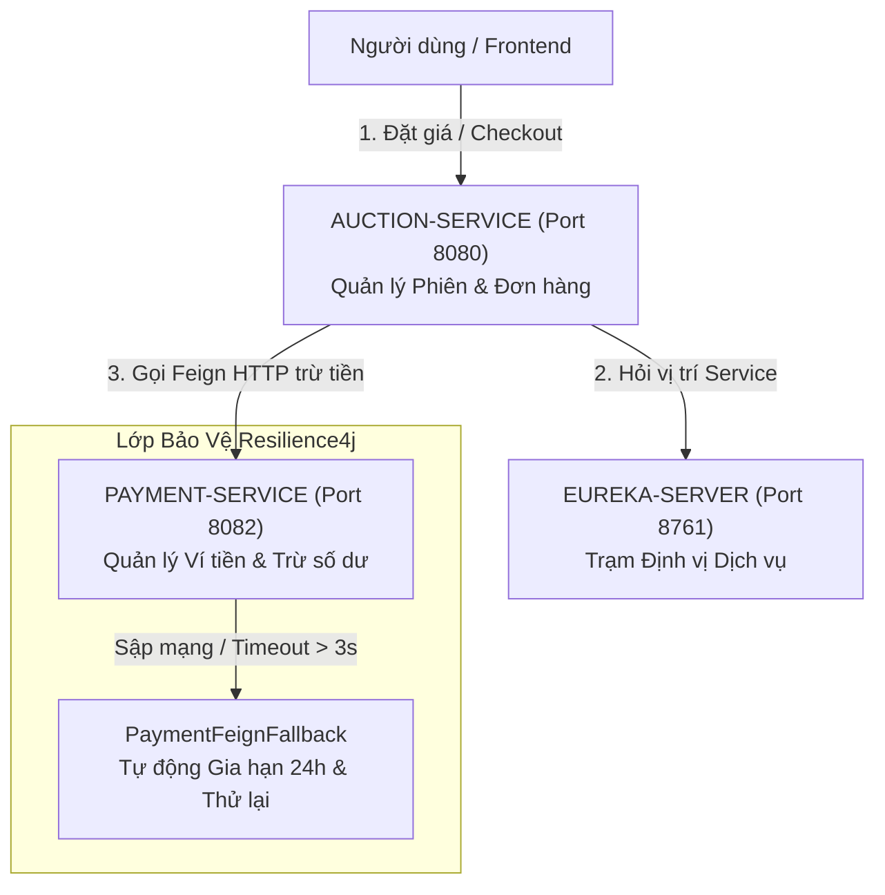

#TÀI LIỆU KIẾN TRÚC MICROSERVICES & TỰ PHỤC HỒI THANH TOÁN (WEEK 7)

## 1.  TỔNG THỂ & PHÂN ĐỊNH VAI TRÒ DỊCH VỤ

###  Bài toán Đặt ra (Mục tiêu Tuần 7):
Ban đầu, toàn bộ hệ thống Đấu Giá nằm chung trong 1 ứng dụng duy nhất (Monolith). Khi số lượng người dùng tăng cao, tính năng **Ví tiền / Thanh toán** cần được tách riêng ra thành 1 dịch vụ độc lập (**Microservice**) để đảm bảo an toàn tài chính và chịu tải tốt hơn.

Hệ thống được chia thành **3 ứng dụng độc lập với phân định nhiệm vụ rõ ràng**:

| Dịch vụ (Microservice) | Cổng (Port) | Vai trò & Nhiệm vụ Chi tiết (Dịch vụ này làm gì?) | Làm như thế nào?) |
| :---| :---:| :---| :---|
| **`eureka-server`** | `8761` | **Trạm Đăng ký & Định vị Dịch vụ Trung tâm** (Danh bạ) • Quản lý địa chỉ IP/Port của tất cả các service. • Kiểm tra sức khỏe (Heartbeat 30s/lần). | Các service khi khởi động sẽ tự đăng ký IP với Eureka. Khi Service A muốn gọi Service B, nó hỏi Eureka để lấy IP mới nhất chứ không hardcode URL. |
| **`auction-service`** | `8080` | **Sàn Đấu Giá Chính & Quản lý Đơn hàng** • Quản lý phiên thầu, đặt giá (Bid), chốt Winner. • Quản lý đơn hàng (`UNPAID`, `PAID`, `SHIPPING`, `COMPLETED`, `CANCELLED`). • Robot `AuctionScheduler` 10s/lần kích hoạt phiên, retry đơn trễ, hủy đơn quá hạn. | Tiếp nhận request từ Client, kiểm tra quyền/điều kiện, gọi `PAYMENT-SERVICE` qua OpenFeign để trừ tiền ví, quản lý trạng thái đơn hàng. |
| **`payment-service`** | `8082` | **Dịch vụ Ví Tiền Ảo & Sổ Sách Tài Chính** • Quản lý số dư Ví (`Wallet`) của từng người dùng. • Xử lý trừ tiền ví Buyer khi Checkout (Tạm giữ Escrow). • Xử lý cộng tiền ví Seller khi Đơn hoàn tất (`COMPLETED`). • Triệt tiêu trừ tiền 2 lần bằng `Idempotency-Key`. | Nhận lệnh từ `AUCTION-SERVICE`. Kiểm tra `Idempotency-Key` trong DB. Nếu hợp lệ ➔ Trừ/Cộng số dư ví và lưu nhật ký giao dịch `payment_transactions`. |

---

### Sơ đồ Kiến trúc & Luồng Gọi nhau (System Architecture):

---

## 2. MÔ HÌNH TẠM GIỮ TIỀN (ESCROW) & GIẢI NGÂN CHO NGƯỜI BÁN (SELLER PAYOUT)

Trong sàn đấu giá, **Tiền không được cộng ngay cho Người bán khi Người mua vừa thanh toán**. Hệ thống áp dụng **Mô hình Tạm Giữ Tiền (Escrow Model)** chuẩn e-Commerce:

### 🔹 Giai đoạn 1: Khi Người mua Checkout (`PAID`)
* `PAYMENT-SERVICE` trừ tiền trong Ví người mua.
* Số tiền này **nằm ở Tài khoản Trung gian của Sàn (Tạm giữ)**.
* **Lý do**: Người bán chưa giao hàng. Nếu cộng ngay cho Người bán, nhỡ Người bán ôm tiền không giao hàng hoặc giao hàng giả thì Người mua sẽ bị mất trắng.

### 🔹 Giai đoạn 2: Khi Đơn hàng Hoàn tất (`COMPLETED` -> Giải ngân cho Seller)
* Người bán giao hàng (`SHIPPING`) ➔ Người mua nhận được hàng ➔ Người mua bấm **"Xác nhận đã nhận hàng thành công"** (`confirmReceived` ➔ Order đổi thành `COMPLETED`).
* `AUCTION-SERVICE` gọi API / gửi sự kiện sang `PAYMENT-SERVICE`.
* `PAYMENT-SERVICE` thực hiện **Giải ngân (Payout)**: Lấy tiền đang tạm giữ **CỘNG VÀO VÍ CỦA SELLER** (sau khi trừ % phí sàn).

---

## 3.KỊCH BẢN THỰC TẾ & LUỒNG XỬ LÝ CHI TIẾT (STEP-BY-STEP FLOWS)

### Kịch bản 1: Thanh toán Bình thường (Thành công 100%)
* **Bối cảnh**: Người mua trúng thầu đơn hàng 5.000.000đ. Ví của người mua có 10.000.000đ. Hệ thống chạy bình thường.
* **Luồng chạy**:
  1. Người mua bấm nút **"Thanh toán"**.
  2. `AUCTION-SERVICE` tạo `Idempotency-Key` duy nhất (ví dụ: `PAY_ORDER_10_USER_5`) và gọi sang `PAYMENT-SERVICE` qua OpenFeign.
  3. `PAYMENT-SERVICE` kiểm tra ví đủ tiền ➔ Trừ 5.000.000đ ➔ Trả về `PaymentStatus.SUCCESS`.
  4. `AUCTION-SERVICE` đổi trạng thái Đơn hàng thành **`PAID`** (Đã thanh toán thành công).

---

### Kịch bản 2: Ví KHÔNG ĐỦ TIỀN (Lỗi Nghiệp Vụ Người Dùng)
* **Bối cảnh**: Đơn hàng 5.000.000đ nhưng ví người mua chỉ còn 1.000.000đ.
* **Luồng chạy**:
  1. Người mua bấm **"Thanh toán"**.
  2. `PAYMENT-SERVICE` kiểm tra thấy thiếu tiền ➔ Trả về HTTP 200 kèm status `INSUFFICIENT_BALANCE`.
  3. `AUCTION-SERVICE` hiển thị ngay thông báo lỗi cho người dùng: *"Ví không đủ tiền, vui lòng nạp thêm!"*.
  4. Đơn hàng **GIỮ NGUYÊN trạng thái `UNPAID`** (vẫn giữ thời hạn 48h ban đầu).
  5. **KHÔNG GIA HẠN 24H** (Vì đây là lỗi thiếu tiền của khách, không phải lỗi sập mạng).

---

### Kịch bản 3: PAYMENT-SERVICE bị Sập hoặc Mạng Chậm (Lỗi Hạ Tầng -> Phục Hồi Êm Ái)
* **Bối cảnh**: Cổng Ví tiền `PAYMENT-SERVICE` bị đứt cáp, đứt mạng hoặc bị nghẽn phản hồi quá 3 giây.
* **Luồng chạy**:
  1. Người mua bấm **"Thanh toán"**.
  2. Quá 3 giây không nhận được phản hồi ➔ **Resilience4j Circuit Breaker** lập tức ngắt mạch khẩn cấp.
  3. Kích hoạt hàm dự phòng **`PaymentFeignFallback`** ➔ Trả về status `PENDING_RETRY`.
  4. `AUCTION-SERVICE` đổi trạng thái Đơn hàng thành **`PAYMENT_PENDING_RETRY`** và **TỰ ĐỘNG CỘNG THÊM 24 GIỜ** vào hạn thanh toán.
  5. Phản hồi êm ái cho người mua: *"Dịch vụ ví đang bảo trì. Đơn hàng của bạn đã được tự động gia hạn 24h để thanh toán lại!"*.

---

### Kịch bản 4: Robot `AuctionScheduler` Tự Động Thử Lại Thanh Toán (Throttling 50 đơn/lần)
* **Bối cảnh**: Sau 5 phút sập mạng, `PAYMENT-SERVICE` đã sống lại. Lúc này có 200 đơn hàng đang ở trạng thái `PAYMENT_PENDING_RETRY`.
* **Luồng chạy**:
  1. Cứ mỗi **10 giây/lần**, Robot `AuctionScheduler` chạy ngầm.
  2. Robot xin CSDL tối đa **50 đơn hàng** `PAYMENT_PENDING_RETRY` cũ nhất (`PageRequest.of(0, 50)` để tránh nghẽn thread).
  3. Robot gọi `PAYMENT-SERVICE` thanh toán bù cho từng đơn.
  4. Khi `PAYMENT-SERVICE` trả về `SUCCESS` ➔ Robot tự động chuyển đơn thành **`PAID`** mà người mua không cần làm gì thêm!

---

### Kịch bản 5: Hết hạn 24h / 48h & Phạt Gậy Công Bằng (Business Fairness)
* **Bối cảnh**: Hết thời hạn mà đơn hàng vẫn chưa được thanh toán thành công.
* **Quy tắc Xử phạt Công bằng**:
  - **Trường hợp A (Đơn `UNPAID` quá 48h)**: Cho 48h mạng mỡ bình thường mà khách **cố tình không trả tiền** ➔ Hủy đơn & **PHẠT +1 GẬY** (Tích đủ 3 gậy sẽ bị khóa tài khoản 90 ngày).
  - **Trường hợp B (Đơn `PAYMENT_PENDING_RETRY` quá 24h)**: Khách **đã bấm trả tiền**, nhưng do `PAYMENT-SERVICE` bị sập 24h liên tục ➔ Hủy đơn nhưng **MIỄN PHẠT GẬY** (Do lỗi hệ thống, không phải lỗi người mua).

---

## 3. CƠ CHẾ BẢO VỆ CHỐNG BỌ / LỖI DỮ LIỆU THỰC TẾ

| STT | Tên Cơ chế Bảo vệ | Vấn đề Thực tế Nếu Không Có | Cách Giải quyết Đã Triển khai trong Code |
| :---: | :---| :---| :---|
| **1** | **Root White-list State Guard** | Một đơn hàng đã bị hủy (`CANCELLED`) do hết hạn, nhưng 1 response thanh toán thành công trả về muộn lại **"Hồi sinh"** đơn thành `PAID`. | Đặt Guard ngay đầu `OrderPaymentTxHelper`: Nếu đơn đã `CANCELLED`, `PAID`, `SHIPPING` hay `COMPLETED` ➔ **Ngắt ngầm 100%**, không cho phép ghi đè Order hay Payment! |
| **2** | **Tái sử dụng Bản ghi `Payment`** | Mỗi lần Robot 10s retry thành công lại `new Payment()` mới ➔ 1 đơn hàng bị lưu 2-3 dòng Payment trùng lặp trong DB. | Dùng `paymentRepository.findByOrder_Id(order.getId())` lấy bản ghi cũ ra để cập nhật từ `PENDING` thành `SUCCESS`. |
| **3** | **Bảo vệ State Machine Payment 1 Chiều** | Trạng thái Payment đang `SUCCESS` bị 1 request trễ cập nhật ngược về `PENDING`. | Nếu `payment.getStatus() == SUCCESS`, giữ nguyên `SUCCESS` vĩnh viễn, không cho phép lùi trạng thái. |
| **4** | **Phân tách DB Transaction** | Đưa lệnh gọi Feign HTTP (chờ 3s) vào trong `@Transactional` ➔ Làm cạn kiệt DB Connection Pool (HikariCP) gây sập cả hệ thống. | Bỏ `@Transactional` ở hàm gọi Feign. Chỉ mở Transaction trong `OrderPaymentTxHelper` khi ghi CSDL. |
| **5** | **Tính Nguyên tử khi Hủy đơn (Atomic Expiration)** | Đơn hàng thì bị hủy nhưng người mua chưa kịp bị phạt gậy do server bị ngắt điện giữa chừng. | Bọc hàm `cancelExpiredOrderAndPenalizeBuyer` trong 1 DB Transaction riêng biệt. |

---

## 4. BẢNG TRA CỨU MÃ NGUỒN (CODE CATALOG)

| Tên File Code | Đường dẫn Chi tiết | Nhiệm vụ Chính trong Hệ thống |
| :---| :---| :---|
| [OrderPaymentTxHelper.java](file:///home/duong/Projects/Backend/auction-service/src/main/java/com/duong/auction/system/service/helper/OrderPaymentTxHelper.java) | `service/helper/OrderPaymentTxHelper.java` | Mở `@Transactional` ghi DB an toàn, bảo vệ Root State Guard 1 chiều, tái sử dụng Payment record. |
| [AuctionScheduler.java](file:///home/duong/Projects/Backend/auction-service/src/main/java/com/duong/auction/system/service/AuctionScheduler.java) | `service/AuctionScheduler.java` | Robot 10s/lần: Tự động kích hoạt phiên, chốt winner, retry 50 đơn/lần, hủy đơn & phạt gậy công bằng. |
| [OrderRepository.java](file:///home/duong/Projects/Backend/auction-service/src/main/java/com/duong/auction/system/repository/OrderRepository.java) | `repository/OrderRepository.java` | Chứa các câu query tìm đơn quá hạn 48h, đơn `PENDING_RETRY` kèm `Pageable` phân trang. |
| [PaymentRepository.java](file:///home/duong/Projects/Backend/auction-service/src/main/java/com/duong/auction/system/repository/PaymentRepository.java) | `repository/PaymentRepository.java` | Chứa query `findByOrder_Id` để tìm và tái sử dụng bản ghi Payment cũ. |
| [PaymentFeignClient.java](file:///home/duong/Projects/Backend/auction-service/src/main/java/com/duong/auction/system/client/PaymentFeignClient.java) | `client/PaymentFeignClient.java` | Khai báo OpenFeign Client gọi API trừ tiền ví sang `PAYMENT-SERVICE` via Eureka. |
| [PaymentFeignFallback.java](file:///home/duong/Projects/Backend/auction-service/src/main/java/com/duong/auction/system/client/PaymentFeignFallback.java) | `client/PaymentFeignFallback.java` | Hàm dự phòng khi `PAYMENT-SERVICE` sập: Trả về `PENDING_RETRY` & gia hạn 24h. |
| [OrderService.java](file:///home/duong/Projects/Backend/auction-service/src/main/java/com/duong/auction/system/service/OrderService.java) | `service/OrderService.java` | Tiếp nhận request Checkout từ Controller, gọi Feign ngoài Transaction. |
